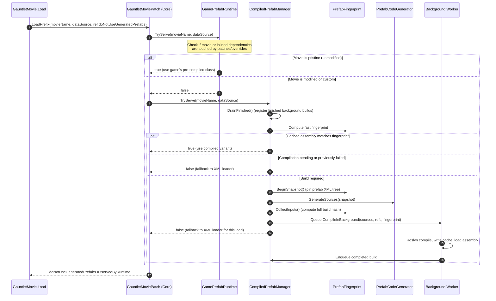

# Compiled Prefabs: Architecture

> [!NOTE]
> This article is written for **UIExtenderEx maintainers and core contributors**.
> Mod authors looking for general usage guidelines and troubleshooting should read [Compiled Prefabs](../general/CompiledPrefabs.md) in the General section instead.

This document details the architectural pipeline in UIExtenderEx (introduced in v3.0.0) that intercepts Gauntlet UI movie loading, transforms patched prefab XML into C# at runtime, compiles it in the background, caches the resulting assemblies, and registers the generated widgets with the game engine.

For why the assemblies are split as they are, see [Why the split is shaped this way](#why-the-split-is-shaped-this-way).

---

## Architecture Overview

### The Problem

TaleWorlds' Gauntlet UI framework supports two mechanisms for instantiating UI movies:

1. **XML Prefab Loader:** Reads and parses prefab XML files from disk at runtime.
2. **Pre-compiled C# Prefabs:** Executes pre-compiled C# widget classes registered in `GeneratedPrefabContext` for specific `(Movie, ViewModel)` pairs.

When a pre-compiled widget class exists for a given movie and ViewModel type, `GauntletMovie.Load` instantiates it directly and bypasses the XML on disk entirely.

Because UIExtenderEx's primary objective is to modify prefab XML (via inserts, replacements, attribute adjustments, and ViewModel mixin bindings), the pre-compiled classes would completely ignore modded changes.

### The Historical Solution (Pre-v3.0.0)

In versions prior to v3.0.0, UIExtenderEx solved this issue aggressively by setting `UIConfig.DoNotUseGeneratedPrefabs = true` globally and patching the configuration setter. This forced all UI movies through the XML loader. While this ensured all mod patches were applied, it introduced noticeable UI load stutter across the entire game.

### The Modern Pipeline (v3.0.0+)

Starting with v3.0.0, UIExtenderEx uses a dynamic, per-load evaluation strategy:

- **Untouched Movies:** If a movie and all prefabs it inlines remain untouched by any patch or override, the game's original pre-compiled C# class is preserved for maximum performance.
- **Patched or Subclassed Movies:** If a movie is patched, uses an overridden XML file, or is bound to an unsupported/subclassed ViewModel, UIExtenderEx:
  1. Serves the first load via the XML loader to prevent blocking the UI thread.
  2. Generates equivalent C# source code from the patched XML using an alternative code generator implementation.
  3. Compiles the generated source asynchronously on a background worker thread using an embedded Roslyn compiler.
  4. Caches the compiled assembly to disk (`CompiledPrefabs.zip`).
  5. Registers the newly generated prefab creator into `GeneratedPrefabContext`, replacing the game's variant for all subsequent loads.

---

## Prefab Runtimes Architecture

To separate concerns and preserve extensibility, UI loading strategies are decoupled into modular **prefab runtimes**.

The core assembly (`Bannerlord.UIExtenderEx`) manages mixin registries, applies XML patches, and installs the interception hook in `GauntletMovie.Load` (`GauntletMoviePatch`). Any component that serves a movie through a mechanism other than the default XML loader implements `IPrefabRuntime` and registers with the core via `Bannerlord.UIExtenderEx.Runtimes.PrefabRuntimes`.

| Runtime | SubModule Assembly | Responsibility |
| :--- | :--- | :--- |
| **XML Runtime** | `Bannerlord.UIExtenderEx.XmlPrefabs` | Delegates directly to the game's `GauntletMovie` XML loader while applying core bug fixes (such as dotted attribute path resolution in `WidgetExtensionsPatch` and template child deduplication in `WidgetTemplatePatch`). Publishes runtime loader capabilities via `PrefabRuntimes.DottedAttributePathsResolve`. |
| **Game Runtime** | `Bannerlord.UIExtenderEx.GamePrefabs` | Preserves and serves the game's native pre-compiled C# variants when no mod patches, file overrides, or runtime registrations affect any prefabs in the movie's dependency tree. Verifies TaleWorlds naming conventions prior to trusting inlined prefabs. |
| **Compiled Runtime** | `Bannerlord.UIExtenderEx.CompiledPrefabs` | Orchestrates runtime code generation, Roslyn background compilation, assembly caching, and creator registration for modified or newly introduced prefabs. |

If no specialized runtime is active or claims a given movie, `GauntletMovie.Load` defaults to the standard XML loader. Consequently, each registered runtime acts strictly as a performance optimization; correctness and patch application are guaranteed even if a runtime fails or is disabled.

---

## Assembly Structure & Responsibilities

The codebase enforces a strict inward dependency model: runtime assemblies depend on the core assembly, but the core assembly never references any runtime assembly directly. This decoupling is verified by automated architecture tests (`RuntimeSplitTests`).

```
                    ┌─────────────────────────────────────────┐
                    │        Bannerlord.UIExtenderEx          │
                    │                 (Core)                  │
                    └────▲───────────────▲───────────────▲────┘
                         │               │               │
         ┌───────────────┴───┐   ┌───────┴───────┐   ┌───┴────────────────────────┐
         │     XmlPrefabs    │   │  GamePrefabs  │   │      CompiledPrefabs       │
         │     (Runtime)     │   │   (Runtime)   │   │         (Runtime)          │
         └───────────────────┘   └───────────────┘   └────▲──────────────────▲────┘
                                                          │                  │
                                             ┌────────────┴─────┐   ┌────────┴────┐
                                             │  CodeGenerator   │   │  Compiler   │
                                             └──────────────────┘   └─────────────┘
```

| Assembly | Root Namespace | Target Frameworks | Responsibilities |
| :--- | :--- | :--- | :--- |
| `Bannerlord.UIExtenderEx` | `Bannerlord.UIExtenderEx` | `netstandard2.0` | Public API for mod authors, prefab patch execution, ViewModel mixin registry, `WidgetFactoryManager`, configuration settings, runtime switch hook (`GauntletMoviePatch`), and the runtime host surface (`Bannerlord.UIExtenderEx.Runtimes`). |
| `Bannerlord.UIExtenderEx.XmlPrefabs` | `Bannerlord.UIExtenderEx.XmlPrefabs` | `netstandard2.0` | `XmlPrefabRuntime` implementation along with two critical engine fixes: `WidgetExtensionsPatch` (resolves dotted attribute property paths correctly) and `WidgetTemplatePatch` (prevents duplicate template allocations in `_customTypeChildren`). |
| `Bannerlord.UIExtenderEx.GamePrefabs` | `Bannerlord.UIExtenderEx.GamePrefabs` | `netstandard2.0` | `GamePrefabRuntime`, `PrefabNames`, and `PrefabOverrideRegistry`. Tracks TaleWorlds pre-compiled variants and determines whether prefabs remain pristine. |
| `Bannerlord.UIExtenderEx.CompiledPrefabs` | `Bannerlord.UIExtenderEx.CompiledPrefabs` | `net472`<br/>`net6.0` | `CompiledPrefabRuntime`, `CompiledPrefabManager`, fingerprint calculation, dependency tracking, cache management, `GeneratedPrefabContextPatch`, and host interface implementations for the code generator. |
| `Bannerlord.UIExtenderEx.CodeGenerator` | `Bannerlord.UIExtenderEx.GauntletUI.CodeGenerator` | `netstandard2.0` | Alternative implementation of the Gauntlet UI code generator with UIExtenderEx enhancements (mixin bindings, fallback dynamic member access via `Bannerlord.UIExtenderEx.GauntletUI.CodeGenerator.Runtime.DynamicMember`). Emits C# source code. |
| `Bannerlord.UIExtenderEx.Compiler` | `Bannerlord.UIExtenderEx.CompiledPrefabs.Compilation` | `net472`<br/>`net6.0` | Roslyn compiler wrapper (`ICSharpCompiler`, `RoslynCompiler`), assembly publicization (`ReferencePublicizer`), access check suppression (`IgnoresAccessChecksSource`), metadata inspection (`PrefabAssemblyReference`), and `VectorsBinding`. Uses ILRepack to internalize Roslyn dependencies. |

> [!NOTE]
> `Bannerlord.UIExtenderEx.Module` is a packaging project rather than a loaded assembly; it references the required projects to output the final module layout for distribution.

### Why the split is shaped this way

- **The compiled runtime is isolated from the core framework:** The core is the public API package (`netstandard2.0`, single DLL), validated against previous releases on every build. It must build, load, and function independently without any specialized runtime present (providing slow but reliable XML fallback). The compiler assembly targets `net472`/`net6.0` and bundles 12 MB of Roslyn; because it is the component most susceptible to antivirus quarantine or missing installation files, failure is contained strictly to the compiled runtime without impacting core mod features.
- **The game runtime resides in its own assembly:** It is the only assembly that relies on internal TaleWorlds generator conventions (`_generatedPrefabs`, class-name heuristics), none of which are public APIs. If a game update alters these conventions, `ConventionsHold` cleanly turns off the runtime. Even without `Bannerlord.UIExtenderEx.GamePrefabs.dll`, all movies continue opening with their patches applied via XML or compiled builds.
- **Mixin hooks remain in the core, not the XML runtime:** `ViewModelWithMixinPatch` serves both runtimes. Generated code accesses mixin instances via `ViewModelMixins.Get<T>` (backed by `MixinInstanceCache`), and `DynamicMember` binds through the same per-instance table (`ViewModelSource`) used by `GauntletView`. Because ViewModels are instantiated before the engine determines which runtime will render the movie, mixin state must remain globally available across XML fallbacks, background compiles, and third-party mod queries.

### Target Frameworks & Game Runtime Compatibility

Mount & Blade II: Bannerlord runs on two different CLR environments depending on the distribution platform:

1. **Steam / GOG / Epic Games:** Runs on the desktop .NET Framework 4.7.2 CLR (reported internally by TaleWorlds as `ApplicationPlatform.CurrentRuntimeLibrary == RuntimeLibrary.Mono`). Binaries reside in `bin/Win64_Shipping_Client`.
2. **Microsoft Store / Xbox App (GDK):** Runs on .NET 6 (`RuntimeLibrary.DotNetCore`). Binaries reside in `bin/Gaming.Desktop.x64_Shipping_Client`.

`Bannerlord.BuildResources` automatically outputs the appropriate build targets into their corresponding game directories:

| Target Framework | Build Property | Target Game Folder |
| :--- | :--- | :--- |
| `net472` | `BuildForWindows` | `bin/Win64_Shipping_Client` |
| `net6.0` | `BuildForWindowsStore` | `bin/Gaming.Desktop.x64_Shipping_Client` |

Because the Roslyn compiler engine requires platform-specific dependencies, `Bannerlord.UIExtenderEx.Compiler` and `Bannerlord.UIExtenderEx.CompiledPrefabs` are multi-targeted for both `net472` and `net6.0`. All other assemblies (Core, `XmlPrefabs`, `GamePrefabs`, and `CodeGenerator`) target `netstandard2.0` and share a single unified build.

---

## Host Interfaces and the Runtimes API

### Code Generator Isolation

The code generator (`Bannerlord.UIExtenderEx.CodeGenerator`) has no compile-time dependencies on the compiled runtime or the core game assemblies. It declares abstract host interfaces for all external services it requires. During startup (`CompiledPrefabRuntime.Install`), the compiled runtime injects concrete implementations:

| Generator Interface | Implemented By (`CompiledPrefabs`) | Registration Point | Purpose |
| :--- | :--- | :--- | :--- |
| `IWidgetRegistrations` | `WidgetFactoryRegistrations` | `CodeGeneratorEnvironment.Registrations` | Resolves custom widget types registered via `WidgetFactoryManager`. |
| `IViewModelMemberResolver` | `MixinMemberResolver` | `ViewModelMemberResolution.Resolver` | Resolves properties and methods introduced by ViewModel mixins. |
| `IDynamicMemberHost` | `DynamicMemberHost` | `DynamicMember.Host` | Supplies runtime reflection and binding fallback when properties are not statically declared. |
| `ICompiledPrefabEnvironment` | `GameCompiledPrefabEnvironment` | Passed to `CompiledPrefabManager.Create(...)` | Encapsulates game environment interactions, settings, and creator class instantiation. |

### Core Runtime APIs (`Bannerlord.UIExtenderEx.Runtimes`)

The core assembly exposes the runtime environment through dedicated query sources:

- **`IPrefabRuntime` & `PrefabRuntimes`:** Handles runtime registration, priority queries (`TryServe`), ownership checks (`IsOwnVariant`), and synchronization flags.
- **`PrefabSource`:** Central event hub for prefab parsing (`Parsed`), registrations (`Registered`), reload notifications (`ReloadRequested`), and environment modifications (`EnvironmentChanged`). Also exposes `AddWidgetTypes` to make late-loaded widget types visible to Gauntlet's internal widget registry. Exceptions in event handlers are safely logged without interrupting game execution.
- **`MixinSource`:** Provides ordered access to registered and active mixins for any target ViewModel type.
- **`ViewModelSource`:** Exposes property and command resolution logic matching active ViewModel instances.
- **`RuntimeSettings`:** Unified settings provider for runtime configuration options (`CompiledPrefabs`, `DumpGeneratedCode`, `RecordTimings`).

### Environmental Synchronization Flags

Two critical environment settings operate outside interface abstractions:

1. **`CodeGeneratorEnvironment.DottedPathsResolveCorrectly`:** Synchronized with `PrefabRuntimes.DottedAttributePathsResolve`. This is validated at startup and before every served load because third-party Harmony patches on `WidgetExtensions.GetObjectAndProperty` can potentially overwrite or revert UIExtenderEx's transpiler fix. The generator must replicate the exact path resolution behavior of the active loader. This flag is also factored into prefab fingerprints.
2. **`CodeGeneratorEnvironment.IsPatched`:** Set by the compiled runtime when Harmony patches are detected on widget property notification methods. The code generator analyzes method IL to discover change notifications; detecting patches ensures that modified IL does not produce invalid notification bindings.

When running standalone unit tests, these environment hooks default to safe no-op or empty implementations.

---

## Runtime Dependencies & Isolation

UIExtenderEx requires only a single external runtime dependency: **`Bannerlord.Harmony`**.

All other external dependencies are compiled into source packages (`Bannerlord.BUTR.Shared`, `Bannerlord.ModuleManager.Source`, `Harmony.Extensions`, `BUTR.MessageBoxPInvoke`) or bundled directly into the assemblies:

- **Bundled Compiler:** Roslyn and its required support libraries are merged into `Bannerlord.UIExtenderEx.Compiler` using ILRepack with full type internalization. This isolates Roslyn completely from other mods and prevents assembly binding redirects or version collisions. ButterLib is not required.
- **Fault-Tolerant Loading:** Bannerlord invokes `Assembly.GetTypes()` on each SubModule assembly prior to instantiation and treats any `ReflectionTypeLoadException` as a critical failure. Consequently, no type in `Bannerlord.UIExtenderEx.CompiledPrefabs.dll` may inherit from, implement, or expose types from `Bannerlord.UIExtenderEx.Compiler.dll` in its public type signatures. If the compiler assembly is missing (e.g. due to antivirus quarantine or partial installation), the runtime installs in a disabled state, allowing patched movies to fall back gracefully to XML (`CompilerMissingTests` verifies this across both frameworks). If a runtime SubModule DLL is missing altogether, the engine displays a standard warning dialog and continues execution without that runtime.
- **Generated Code References:** Generated assemblies reference `Bannerlord.UIExtenderEx.CodeGenerator` (for runtime dynamic member dispatch) and `Bannerlord.UIExtenderEx` (for `ViewModelMixins.Get<T>`). Both assemblies are explicitly registered as compilation references.
- **Generation Invalidation:** The cache archive generation hash (`PrefabFingerprint.ComputeGeneration`) combines the Module Version IDs (MVIDs) of `CompiledPrefabs`, `CodeGenerator`, `Compiler`, and the core TaleWorlds Gauntlet and Library assemblies. Any update to the game or UIExtenderEx automatically invalidates stale cached assemblies.

---

## Lifecycle & Startup Sequence

> [!NOTE]
> For the broader framework lifecycle (including mod registration phases, enable/disable toggling, and teardown), see [Core Runtime Lifecycle](../runtime/Lifecycle.md).

The module's `SubModule.xml` registers four SubModules in strict execution order:

1. `Bannerlord.UIExtenderEx` (Core)
2. `Bannerlord.UIExtenderEx.XmlPrefabs` (XML Runtime)
3. `Bannerlord.UIExtenderEx.GamePrefabs` (Game Runtime)
4. `Bannerlord.UIExtenderEx.CompiledPrefabs` (Compiled Runtime)

The TaleWorlds engine instantiates all SubModules first, then calls their `OnSubModuleLoad` methods sequentially in the declared order:

```
[Start-up]
   │
   ├─► 1. Core Static Constructor
   │      Checks 'DisableGeneratedPrefabs'. If true, enables UIConfig.DoNotUseGeneratedPrefabs.
   │
   ├─► 2. Runtime Constructors
   │      - XmlPrefabs: Applies WidgetExtensionsPatch & WidgetTemplatePatch.
   │      - GamePrefabs: Registers with PrefabRuntimes; monitors pristine game variants.
   │      - CompiledPrefabs: Registers host interfaces, hooks PrefabSource events,
   │                         patches GeneratedPrefabContext.CollectPrefabs, registers runtime.
   │
   ├─► 3. Core OnSubModuleLoad
   │      Executes UIExtender static constructor; applies GauntletMoviePatch hook
   │      (skipped when DisableGeneratedPrefabs is on).
   │
   └─► 4. CompiledPrefabs OnSubModuleLoad
          Initializes CompiledPrefabManager and schedules background warm-up worker
          (cache preloading, JIT warming, throwaway Roslyn compile).
```

### Detailed Startup Steps

1. **Core Static Initialization:** Checks the `DisableGeneratedPrefabs` setting. If enabled, it force-loads `TaleWorlds.Engine.GauntletUI` and sets `UIConfig.DoNotUseGeneratedPrefabs = true`, disabling all pre-compiled prefabs globally. Any subsequent modifications to `UIConfig.DoNotUseGeneratedPrefabs` (via MCM or the developer console command `ui.use_generated_prefabs`) are captured by `UIConfigPatch` and persisted across sessions.
2. **Runtime Construction:**
   - `XmlPrefabRuntime` applies its XML loader patches.
   - `GamePrefabRuntime` registers with `PrefabRuntimes` and begins tracking TaleWorlds variant collections.
   - `CompiledPrefabRuntime` installs generator host implementations, subscribes to `PrefabSource` events, installs `GeneratedPrefabContextPatch` (to re-register cached variants after an engine resource refresh), and registers with `PrefabRuntimes`. Because runtimes are queried in registration order, the Game runtime is checked first, ensuring unpatched prefabs are never unnecessarily compiled.
3. **Core Patch Application:** `OnSubModuleLoad` in the core assembly triggers the static constructor of `UIExtender`, immediately applying the Harmony patches (including `GauntletMoviePatch`). This ensures the load switch is active before any game UI screen can open. When `DisableGeneratedPrefabs` is on, this step is skipped: no generated prefab is used, so nothing needs the switch early, and the patches are applied on the first access to `UIExtender`, normally a mod's `UIExtender.Create`.
4. **Compiled Runtime Warm-up:** `OnSubModuleLoad` creates the singleton `CompiledPrefabManager` via `CompiledPrefabManager.Create(...)`. If environment validation fails (such as a missing compiler assembly), a fallback `DisabledCompiledPrefabEnvironment` is used, leaving all patched movies on the XML loader. If enabled, a background worker is dispatched to preload cached assemblies, JIT-compile critical code generator routines, and execute a warm-up Roslyn compilation (see [Pipeline: Warm-up](Pipeline.md#14-system-warm-up-warmupcompilers)).

---

## Life of a Movie Load

The diagram below illustrates the decision flow when `GauntletMovie.Load` is called:



### Post-Load Worker Draining

When a background compilation job finishes on the worker thread, its result is pushed to a thread-safe queue. On the next movie load request (for any movie), `DrainFinished` executes on the main thread and registers the newly compiled creator into `GeneratedPrefabContext`. The next time that specific movie and ViewModel pair is loaded, `TryServe` immediately finds the registered creator and serves the compiled class.

---

## Threading Model

To ensure thread safety and avoid race conditions with Gauntlet UI's single-threaded architecture, execution responsibilities are partitioned across threads:

### Main Thread (UI Thread)

- All `GauntletMovie.Load` interception logic and runtime selection.
- Prefab XML snapshotting and code generation (`PrefabCodeGenerator.GenerateSources`).
- Draining completed worker results and registering creators in `GeneratedPrefabContext`.
- Mixin resolution and dynamic member reflection dispatch.

### Background Worker Threads

- **Roslyn Compilation:** `CompileInBackground` invokes the C# compiler asynchronously.
- **Assembly Loading:** Executing `Assembly.Load` off the UI thread avoids UI stutters caused by third-party mod assembly-load listeners (a load took 90–210 ms in a modded game, against 1–15 ms for the load itself; see [Off-Thread Assembly Loading](Compilation.md#off-thread-assembly-loading)).
- **Disk I/O:** Reading and writing `.dll` files to `CompiledPrefabs.zip` and flushing the cache index (`PrefabCache.Flush`).
- **Initial Warm-up:** Preloading cached assemblies and pre-compiling code generator methods.

Only immutable data structures (source text strings, reference file paths, and type dependency descriptors) cross the boundary to worker threads. The prefab XML snapshot is released on the main thread as soon as code generation finishes.

---

## Naming Conventions & Identifiers

Generated assemblies and types follow deterministic naming rules:

- **Root Namespace:** `Bannerlord.UIExtenderEx.AutoGenerated`. All generated assemblies share this prefix. The prefix is checked by `IsGeneratedAssembly` and `IsOwnVariant` to ensure generated assemblies are never treated as external compilation references.
- **Assembly Name:** Formatted as `Bannerlord.UIExtenderEx.AutoGenerated.<Movie>.<ViewModelName>.<BuildTagHex>`, where `<BuildTagHex>` represents the first 16 hexadecimal characters of the build tag hash (combining the input fingerprint, inspected types, and reference assembly MVIDs). This ensures a rebuilt variant receives a distinct assembly identity even if the old version remains in memory.
- **Root Widget Class:** Formatted as `<Prefab>__<Variant>`, where `<Variant>` is the sanitized full name of the ViewModel. Names are normalized using `GeneratedNaming.GetUsableName`: dots become underscores, and characters invalid in C# identifiers (such as `+` for nested classes or hyphens in filenames) are replaced with their hexadecimal unicode values delimited by underscores (e.g., `_002B_`).
- **Inlined Dependency Classes:**
  - Standard child prefab: `<Root>_Dependency_<Index>_<Prefab>__DependendPrefab`.
  - Inherited base prefab: `<Root>_Dependency_<Index>_<Prefab>__InheritedPrefab`.
  - List item template: `<Root>_Dependency_<Index>_<Identifier>` (without suffix).
- **Prefab Creator Class:** `GeneratedUIPrefabCreator` containing `CollectGeneratedPrefabDefinitions(GeneratedPrefabContext)`. Bound by name dynamically via `GameCompiledPrefabEnvironment.CreateCreator`. It intentionally does not implement `IGeneratedUIPrefabCreator` directly to prevent Gauntlet's eager assembly scanner from registering it prematurely.

---

## Related Documentation

- [Pipeline](Pipeline.md): Detailed breakdown of the load decision tree, `CompiledPrefabManager`, fingerprint calculations, and cache serialization.
- [Code Generator](Generator.md): Alternative code generator implementation details, mixin binding generation, and by-name binding fallback strategies.
- [Handling Differences](HandlingDifferences.md): Managing structural and schema discrepancies in Gauntlet prefabs.
- [Deviations from XML](XmlDeviations.md): Documented differences between XML loader behavior and compiled C# execution.
- [Compilation](Compilation.md): Deep dive into Roslyn bundling, ILRepack internalization, reference publicizing, and access check suppression.
- [Testing](Testing.md): Architectural test suites, runtime verification harnesses, and benchmark suites.

