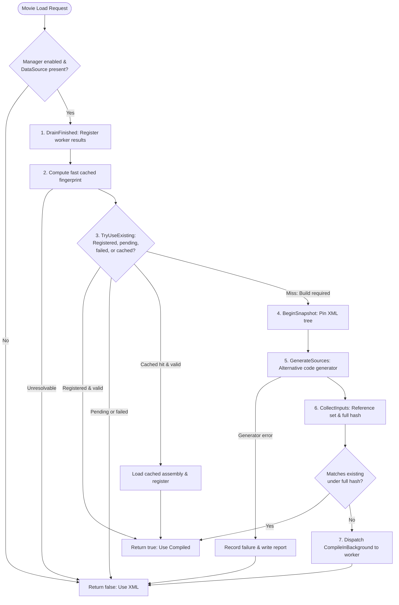

# Prefab Compilation Pipeline

> [!NOTE]
> This article is written for **UIExtenderEx maintainers and core contributors**.
> It covers the internal mechanisms between the game requesting a Gauntlet UI movie and the registration of a compiled C# widget assembly.
> For the high-level architecture, see [Overview](Overview.md). For details on C# code emission, see [Code Generator](Generator.md).

---

## 1. The Movie Load Decision

The entry point into the pipeline is a Harmony prefix patch on Gauntlet UI's movie loader:

```csharp
GauntletMovie.Load(WidgetFactory widgetFactory, string movieName, IViewModel datasource, ref bool doNotUseGeneratedPrefabs, ...)
```

The hook is implemented in `GauntletMoviePatch.LoadPrefix` in the core assembly. The patch only applies if this specific engine overload exists. Its installation status is tracked by `PrefabRuntimes.IsMovieSwitchInstalled`, which gatekeeps the compiled prefabs feature: if the switch is not installed, `GameCompiledPrefabEnvironment.IsEnabled` evaluates to `false`, and no preloading or runtime compilation will occur.

### Decision Flow Algorithm

When `GauntletMovie.Load` executes, the prefix applies the following evaluation sequence:

```text
LoadPrefix(widgetFactory, movieName, datasource, ref doNotUseGeneratedPrefabs)
  1. If doNotUseGeneratedPrefabs is already true:
       -> Return immediately (the engine or an external caller explicitly requested XML loading).
  2. For each registered IPrefabRuntime (in registration order):
       -> If runtime.TryServe(widgetFactory, movieName, datasource) returns true:
            -> Return immediately (the runtime vouched for and served the variant).
       -> If runtime.TryServe throws an exception:
            -> Log the failure, treat as declined (false), and query the next runtime.
  3. If all runtimes decline:
       -> Set doNotUseGeneratedPrefabs = true (fall back to the game's native XML loader).
```

### Runtime Evaluation Order

Runtimes register during module startup in the order declared in `SubModule.xml`:

1. **`GamePrefabRuntime` (Game Runtime)**: Evaluates whether TaleWorlds' pre-compiled assembly for the movie is still valid and unmodified.
2. **`CompiledPrefabManager` (Compiled Runtime)**: Evaluates whether a compiled assembly is cached, currently compiling, or needs to be scheduled for background compilation.

Because `GamePrefabRuntime` is evaluated first, pristine movies that are completely untouched by mod patches or overrides are served by the game's pre-compiled classes without any overhead.

> [!NOTE]
> The obsolete attribute property `PrefabExtensionAttribute.AutoGenWidgetName` is maintained solely for backward binary compatibility with older mods and has no effect on runtime dispatching.

---

## 2. The Game Prefab Runtime (`GamePrefabRuntime`)

`GamePrefabRuntime.TryServe` checks TaleWorlds' internal prefab dictionary:

```csharp
GeneratedPrefabContext._generatedPrefabs: Dictionary<string, Dictionary<string, CreateGeneratedWidget>>
```

This table is keyed by movie name, and then by variant name (the full type name of the `IViewModel` data source, or `"Default"`).

### Declination Criteria

`GamePrefabRuntime.TryServe` declines to serve a movie (`returns false`), passing responsibility to the compiled runtime, when any of the following conditions occur:

1. **Missing Variant**: No entry exists for the requested `(Movie, ViewModel)` pair. This applies to movies TaleWorlds never pre-compiled, as well as situations where a mod subclasses a base ViewModel. A subclass alters the variant key, causing a miss against the class generated for the base type.
2. **Runtime-Owned Variant**: The registered creator belongs to a runtime assembly (`PrefabRuntimes.IsRuntimeVariant`). A compiled build produced in an earlier session reflects a specific snapshot in time; its validity must be verified by `CompiledPrefabManager` against current fingerprints.
3. **Naming Convention Invalidation**: TaleWorlds naming conventions fail validation (`ConventionsHold` returns `false`).
4. **Missing Root Widget Class**: The root widget type cannot be resolved from the creator delegate.
5. **Patched Inlined Prefabs**: Any prefab inlined into the movie's widget tree appears in `PrefabSource.PatchedPrefabNames` (which lists prefabs modified by at least one currently **enabled** patch).
6. **Runtime-Registered Prefabs**: Any inlined prefab was registered at runtime via `WidgetFactoryManager`, replacing the original XML definition.
7. **Cross-Module Prefab Overrides**: `PrefabOverrideRegistry.ContainsOverridden` detects that more than one loaded module provides an XML file for an inlined prefab name.

All prefab names are compared using `PrefabNames.Normalize`. TaleWorlds' code generator writes dotted prefab names with underscores (e.g., `ClanControl.*` becomes `ClanControl_*`), while Native ships 94 prefabs with dots in their filenames. Normalization reconciles these representations before comparison.

### Convention Verification (`ConventionsHold`)

Because TaleWorlds' generated widget class names are not a public API, changes across game patches could silently break dependency analysis. If class naming changed, dependency discovery might return incomplete results, causing the game runtime to falsely assume a patched movie was pristine and render a stale, unpatched variant.

To prevent this, `ConventionsHold` validates the game's pre-compiled variants against the active `WidgetFactory`:

- Every variant not owned by a dynamic runtime must resolve to a valid root widget class.
- The root widget class must encode its own movie name.
- Every dependent prefab name extracted from generated classes must resolve to a known prefab in `WidgetFactory.GetPrefabNames`.

If a single convention check fails, `GamePrefabRuntime` declines **all** movies until the game collects its variants again (the next resource refresh), logging the first ten unresolvable names once. All movies then safely route through the compiled runtime or fall back to XML.

Because Gauntlet UI rebuilds its variant collections on resource refreshes, convention verdicts are tracked per `GeneratedPrefabContext` instance using a `ConditionalWeakTable`. A Harmony postfix on `CollectPrefabs` invalidates the cached verdict upon each refresh. For Native's 79 pre-compiled variants, convention validation completes in 15–26 ms on initial run and 0–2 ms on subsequent checks.

### Inlined Prefab Set Discovery (`GetAutoGenNames`)

To determine whether any sub-prefab embedded inside a movie is patched, `GetAutoGenNames(Type rootWidgetType)` discovers all prefabs inlined into a pre-compiled widget class. It combines two complementary discovery strategies:

1. **Dependency Sibling Analysis**: TaleWorlds' generator emits inlined prefabs as sibling classes in the same assembly using the pattern `<Root>_Dependency_<n>_<Prefab>`. All types in the root assembly matching this prefix are collected. This captures prefabs instantiated dynamically within method bodies (such as `ClanPartyTuple` inside `ClanScreen`), which cannot be discovered via fields.
2. **Widget Field Graph Traversal**: A visited-set graph traversal over all fields of type `Widget` (or derived classes) discovers classes generated for other movies that are referenced by the root. An iterative graph walk is used rather than recursion to avoid stack overflow exceptions caused by circular widget references (e.g., `InventoryScreenWidget` and `InventoryItemButtonWidget` hold mutual references).

Results are cached per root widget type. The root widget type is extracted from the creator delegate via `GetRootWidgetType` (e.g., a method `CreateX` creating type `X` within the creator's assembly), avoiding assembly-wide type scans.

`GetPrefabName(string className)` converts generated class names back into XML prefab names:

| Class Name Pattern | Resolved Prefab Name | Rule |
| :--- | :--- | :--- |
| `Inventory__TaleWorlds_..._SPInventoryVM` | `Inventory` | Substring prior to the first `__`. |
| `Inventory__..._Dependency_3_InventoryEquippedItemSlot__DependendPrefab` | `InventoryEquippedItemSlot` | Name following `_Dependency_<n>_`, stripping the `__DependendPrefab` suffix. |
| `Inventory__..._Dependency_2_Something__InheritedPrefab` | `Something` | Name following `_Dependency_<n>_`, stripping the `__InheritedPrefab` suffix. |
| `Inventory__..._Dependency_1_ItemTemplate` | `Inventory` | Item template of the root XML (no suffix); resolves to the root movie name. |

### Detecting Cross-Module Prefab Overrides (`PrefabOverrideRegistry`)

When multiple modules ship a prefab with the same relative path under their `GUI/Prefabs` directory, the last loaded module wins. The game's `ResourceDepot.CollectResources` only stores the winning file, making it impossible to query whether an override occurred after the fact.

`PrefabOverrideRegistry` re-scans the depot's `_resourceLocations`, inspecting each location for `*.xml` files (using an explicit `EndsWith(".xml")` check to avoid Windows wildcard matching on `.xml_dev`). Any prefab name encountered in more than one module location is flagged as overridden. Overridden prefabs are treated as modified, ensuring movies embedding them are compiled rather than served from stale pre-compiled assemblies.

### Context Re-collection (`GeneratedPrefabContextPatch`)

When the engine reloads resources, `GeneratedPrefabContext.CollectPrefabs` clears its internal registry and rescans all loaded assemblies for classes implementing `IGeneratedUIPrefabCreator`.

UIExtenderEx's compiled creator classes **intentionally do not implement this interface**. Implementing it would cause Gauntlet's eager scanner to register cached assemblies indiscriminately at startup, bypassing fingerprint validation.

To restore compiled variants after a resource reload, `GeneratedPrefabContextPatch` applies a postfix to `CollectPrefabs` that invokes `OnPrefabsCollected`. This method drains any completed background compilation jobs, clears stale factory-keyed caches, and re-executes the registration delegate for every active build.

---

## 3. The Compiled Prefab Manager (`CompiledPrefabManager`)

`CompiledPrefabManager` (located in `Bannerlord.UIExtenderEx.CompiledPrefabs`) is the state machine orchestrating code generation, compilation, caching, and registration. It interacts with the game environment strictly through `ICompiledPrefabEnvironment`, allowing the entire manager to be verified using unit test fakes (`CompiledPrefabManagerTests`).

### State Structure

All manager state is keyed by `PrefabKey(string Movie, string Variant)`, where `Variant` is the full type name of the ViewModel (matching `GeneratedPrefabContext`'s internal dictionary keys):

| Field | Type | Description |
| :--- | :--- | :--- |
| `_registered` | `Dictionary<PrefabKey, RegisteredPrefab>` | Builds currently registered with Gauntlet, storing their fingerprint, dependency records, and re-collection delegate. |
| `_pending` | `HashSet<PrefabKey>` | Movies currently undergoing background compilation. Only one job runs per key at a time; pending movies load via XML. |
| `_failed` | `Dictionary<(PrefabKey, string Fingerprint), int>` | Failed builds, mapped to the `UIEnvironmentVersion` during failure. Failures are not retried unless the fingerprint changes or an environment version increments. |
| `_warned` | `HashSet<(PrefabKey, string Fingerprint)>` | Tracks failure notifications displayed to the user to prevent duplicate on-screen warning popups. |
| `_finished` | `ConcurrentQueue<CompileJobResult>` | Thread-safe queue holding compilation results produced by worker threads, awaiting main-thread registration. |
| `_preloaded` | `ConcurrentDictionary<string, (PrefabCacheEntry, Assembly)>` | Assemblies loaded into memory during system warm-up, keyed by `PrefabCacheEntry.Key`. |
| `_unreadableReferences` | `HashSet<string>` | Assembly file paths that could not be read from disk. Failures are warned once; affected movies retry each load. |
| `_cache` | `PrefabCache?` | Thread-safe handle to the disk cache archive (`CompiledPrefabs.zip`). Lazily initialized under `_cacheLock`. |
| `IsDisabled` | `bool` | Set if an unhandled exception occurs on the main thread or if the environment cannot be initialized. When disabled, all movies route to the XML loader. |

### Resilient Exception Handling

Unexpected exceptions in `TryUseCompiledPrefab` or `OnPrefabsCollected` invoke `Disable(Exception)`, permanently disabling the manager for the remainder of the game session to protect stability.

Expected, non-fatal errors (such as a single movie failing code generation) are recorded per `PrefabKey` and do not disable the manager. If a referenced assembly file on disk is locked or unreadable, `PrefabReferenceSet` throws `PrefabReferenceException`; only movies requiring that specific assembly fall back to XML, while all other movies continue compiling normally.

Critical entry points are protected by `[MethodImpl(MethodImplOptions.NoInlining)]` wrappers. Because the JIT compiles an entire method at once, referencing types from `Bannerlord.UIExtenderEx.Compiler` in a method body would trigger JIT compilation failures on startup if the compiler assembly were missing. The wrappers ensure checks against `IsDisabled` occur before any compiler types are resolved.

---

## 4. Execution Flow of `TryUseCompiledPrefab`

When `CompiledPrefabRuntime.TryServe` queries the manager, execution proceeds through the following steps on the main thread:



### Detailed Execution Steps

#### 1. Drain Finished Worker Jobs (`DrainFinished`)
All completed compilation results in `_finished` are dequeued on the main thread. Finished keys are removed from `_pending`. Successful assemblies are registered via `TryRegister`. Failed jobs record their failure state, write error logs, and display an on-screen warning once per unique fingerprint.

#### 2. Fast Fingerprint Calculation (`ComputeFingerprint`)
A lightweight fingerprint is computed using `environment.ComputeFingerprint(factory, movie, vmType, out failure)`. This utilizes the cached `PrefabSection` for the movie. If any prefab in the tree lacks an XML hash or is unknown to the factory, the check fails and the movie falls back to XML.

#### 3. Query Existing Builds (`TryUseExisting`)
The manager evaluates four conditions in order:
1. **Registered**: A build is already registered under this fingerprint and its dependencies remain valid $\to$ returns `true`.
2. **Pending**: A background worker is currently compiling this pair $\to$ returns `false` (serves XML while waiting).
3. **Failed**: The pair previously failed on this fingerprint under the current `UIEnvironmentVersion` $\to$ returns `false`.
4. **Cached on Disk**: `TryUseCachedBuild` searches `_preloaded`, then checks the local `PrefabCache` archive and seed caches. If a valid build matching the fingerprint and dependencies is found, it is loaded, registered, and served $\to$ returns `true`.

#### 4. Tree Snapshotting (`BeginSnapshot`)
If no existing build is found, compilation is required. The manager creates an atomic `PrefabCompilationSnapshot`. This establishes a `PrefabLease` that pins the entire XML prefab tree in memory, preventing external patches or resource refreshes from altering the XML mid-generation.

#### 5. Code Generation (`GenerateSources`)
The alternative code generator (`PrefabCodeGenerator`) executes on the main thread against the pinned snapshot. An active `TypeDependencies` session tracks every type and member inspected during generation. If code generation throws an exception, the failure is logged under `Failed/<Movie>/<ViewModel>`, and the movie falls back to XML.

#### 6. Input Collection & Final Hash Verification (`CollectInputs`)
`snapshot.CollectInputs()` resolves the compilation reference paths and computes the final compilation fingerprint over the exact pinned parse (`PrefabCompilationInputs`). References are collected after generation because code generation can dynamically trigger the loading of assemblies referenced by name. `TryUseExisting` is evaluated once more against this final hash in case an identical build exists under the exact input hash.

#### 7. Worker Dispatch (`CompileInBackground`)
An access-check suppression source file (`IgnoresAccessChecks.gen.cs`) is appended to the compilation unit. The pair is marked as pending in `_pending`, and a compilation task is dispatched to a background worker thread via `ICompiledPrefabEnvironment.RunInBackground`. The method returns `false`, allowing the current load request to be served seamlessly via XML while compilation proceeds asynchronously.

The snapshot is disposed when the method exits, releasing all pinned prefab leases.

---

## 5. Background Compilation & Assembly Loading

`CompileInBackground` executes on a thread-pool worker:

```
[Main Thread]                             [Worker Thread]
      │                                          │
      ├─► Queue CompileInBackground ────────────►│
      │                                          ├─► 1. ICSharpCompiler.Compile
      │                                          ├─► 2. PrefabDependencies.Compose
      │                                          ├─► 3. PrefabCache.WriteToCache
      │                                          ├─► 4. Assembly.Load(bytes)
      │                                          ├─► 5. PrefabCache.Flush
      │                                          │
      │◄── Enqueue CompileJobResult ─────────────┴─► Return
      │
[Next Movie Load]
      │
      └─► DrainFinished() -> TryRegister() -> Serve
```

### Worker Lifecycle Steps

1. **Compilation**: Invokes `ICompiledPrefabEnvironment.Compiler` (Roslyn) with the source strings and reference paths.
2. **Dependency Composition**: On success, `PrefabDependencies.Compose` maps the inspected types and generated `AssemblyRef` table entries to concrete assembly paths.
3. **Disk Cache Storage**: The compiled bytes, fingerprint, and dependency records are written to `PrefabCache`. If `DumpGeneratedCode` is enabled, source files are written to `Sources/<Movie>/<ViewModel>/`.
4. **Off-Thread Assembly Loading**: The assembly is loaded into the process via `Assembly.Load(byte[])` **on the worker thread**. In heavily modded setups, third-party mod assembly-load listeners can extend load times to 90–210 ms (see [Off-Thread Assembly Loading](Compilation.md#off-thread-assembly-loading)); running this off-thread prevents UI frame drops.
5. **Cache Flush**: `PrefabCache.Flush` updates the archive on disk.
6. **Result Queueing**: Exactly one `CompileJobResult` is enqueued into `_finished`.

If compilation or assembly loading fails, an error report containing the exception details, compiler diagnostic messages, and source files is written to `Failed/<Movie>/<ViewModel>/`.

---

## 6. Creator Registration & Gauntlet Integration

When `DrainFinished` dequeues a successful build, it invokes `TryRegister`, calling `environment.CreateCreator(assembly)`:

1. **Creator Discovery**: Resolves the generated class `Bannerlord.UIExtenderEx.AutoGenerated.GeneratedUIPrefabCreator` and its registration method `CollectGeneratedPrefabDefinitions(GeneratedPrefabContext)`.
2. **Widget Table Registration**: Discovers every `Widget` subclass in the compiled assembly and registers it in Gauntlet's internal `WidgetInfo` table via `WidgetInfo.AddWidgetType`. Without this step, instantiating the widget during movie rendering throws an exception.
3. **Widget Validation**: Queries `WidgetInfo.GetWidgetInfo` for each registered widget type to ensure initialization succeeded.
4. **Delegate Binding**: Creates an `Action<GeneratedPrefabContext>` delegate bound to the creator's collection method.

The manager executes the delegate against the current `GeneratedPrefabContext` and stores the registration in `_registered`.

---

## 7. The Prefab Fingerprint (`PrefabFingerprint`)

A compiled assembly is only valid for the exact inputs from which it was generated. The **fingerprint** is a SHA-256 hash computed over an ordered text specification generated by `PrefabFingerprint.Compose`:

```text
generation:<GenerationHash>
viewmodel:<Type, Assembly>
dottedpaths:<True|False>
widget:<Name>=<FullTypeName>, <Assembly>
widgetpatched:<Name>=<Type>.<Method> is patched
mixintarget:<Type, Assembly>
mixin:<Type, Assembly>
prefab:<Name>:<XmlSha256>
```

### Fingerprint Components

- **`generation`**: Output of `PrefabFingerprint.ComputeGeneration()`. Hashes the MVIDs of the core assemblies (`CompiledPrefabs`, `CodeGenerator`, `Compiler`) and the four primary TaleWorlds UI assemblies (`TaleWorlds.Library`, `TaleWorlds.GauntletUI`, `TaleWorlds.GauntletUI.PrefabSystem`, `TaleWorlds.GauntletUI.Data`). Any update to UIExtenderEx or the base game invalidates all cached fingerprints.
- **`viewmodel`**: The full type name and assembly of the root ViewModel data source.
- **`dottedpaths`**: Current value of `CodeGeneratorEnvironment.DottedPathsResolveCorrectly`.
- **`widget`**: Alphabetically sorted mappings of widget tag names to concrete widget types and assemblies in the prefab closure (or `"(prefab)"` / `"(unresolved)"`).
- **`widgetpatched`**: Emitted when a widget class has a method patched by Harmony. The generator tracks widget change notifications using method IL; if a method is patched, IL inspection is bypassed, altering code emission.
- **`mixintarget` / `mixin`**: Grouped by target ViewModel and ordered by resolver priority. Mixin order is preserved because `MixinMemberResolver` selects the *last* registered mixin providing a given property name; sorting would obscure registration order changes.
- **`prefab`**: Alphabetically sorted SHA-256 hashes of the patched XML content for every prefab in the movie's dependency tree.

> [!IMPORTANT]
> The fingerprint text explicitly **excludes assembly versions and reference lists**. Referencing assemblies are validated independently via the dependency tracking system.

---

## 8. Assembly Dependency Tracking (`PrefabDependencies`)

Rather than hashing every referenced assembly into the fingerprint (which would cause a rebuild of every UI screen whenever an unrelated mod or library updated), UIExtenderEx isolates dependencies per build.

A build depends strictly on two sources:

1. **Inspected Types (`TypeDependencies`)**: Recorded during code generation. Tracks every type and member queried by the generator (property lookups, method overloads, constructors, list element types, widget property paths, and mixin targets). Types are expanded to include base classes, interfaces, generic arguments, and declaring types.
2. **Emitted Assembly References (`UsedReferencePaths`)**: Derived from the emitted assembly's `AssemblyRef` metadata table, mapped back to the assemblies passed to the compiler.

Because generated C# uses fully qualified type names (`global::`) and contains no `using` directives, external assemblies cannot introduce extension methods or namespace collisions unnoticed.

### Dependency Descriptions

Each dependency is recorded as `name:description`:

- **Game and Module Assemblies**: Described by their Module Version ID (MVID).
- **Machine Framework Assemblies**: Described by assembly version (e.g., `System.Runtime` version `6.0.0.0`). Framework servicing updates preserve binary compatibility while changing MVIDs; using versions prevents Windows updates from invalidating the cache.
- **Dynamic / Byte-Loaded Assemblies**: Described by MVID extracted from memory.

### Fast Dependency Validation (`FindChanged`)

When checking a cached build, `FindChanged` validates each recorded dependency against currently loaded assemblies. If an assembly is not yet loaded, candidate files in the game and module search directories are checked.

Once an assembly is loaded into the process, its identity cannot change; validation resolves via quick hash set lookups, completing in microseconds.

---

## 9. XML Registry & Prefab Closures

### Post-Patch XML Hashing (`PrefabXmlRegistry`)

`PrefabXmlRegistry` maintains SHA-256 hashes of prefab documents **after** all UIExtenderEx patches have been applied.

It subscribes to `PrefabSource.Parsed`, which is triggered by:
- `WidgetPrefabPatch`: A transpiler on `WidgetPrefab.LoadFrom` that executes after `PrefabComponent.ProcessMovieIfNeeded` patches the document.
- `WidgetFactoryManager.Create`: Captures prefabs constructed programmatically in code.

The registry tracks two tables:
- `Hashes`: Maps a prefab name to its latest XML hash.
- `ParsedHashes`: A `ConditionalWeakTable<WidgetPrefab, string>` associating a parsed prefab instance with its document hash. This ensures a prefab constructed outside standard channels cannot inherit an outdated hash sharing its name.

### Prefab Sections (`PrefabSection`)

Parsing a movie's complete prefab closure (nested prefabs, inherited prefabs, and list item templates) can require 200–350 ms. `PrefabFingerprint.PrefabSection` caches this traversal:

- `Hashes`: Dictionary of all prefab names in the closure to their XML hashes.
- `WidgetTypes`: Sorted array of all widget tag names declared across the closure.
- `Text`: Pre-computed `prefab:` fingerprint lines.
- `Factory` / `RegistrationVersion`: The factory and version against which the section was calculated.

A section is valid (`IsCurrent`) if the factory matches, `PrefabXmlRegistry.Version` is unchanged, all prefab hashes match, and no prefab in the closure was registered via a dynamic callback. Sections are invalidated when `WidgetFactoryManager.ReloadOnNextUse` triggers `PrefabSource.ReloadRequested`.

---

## 10. Snapshots & Factory Pinning

TaleWorlds' `WidgetFactory` uses reference counting for loaded prefabs: `GetCustomType` parses XML on first request and retains the instance as long as its live usage count is greater than zero.

### Factory Leases (`PrefabLease`)

To prevent the code generator and fingerprint calculations from permanently locking prefabs in memory, `WidgetFactoryLookup.PrefabLease` provides a thread-static lexical scope:

```csharp
using (PrefabLease.Begin(factory, pin: true))
{
    // All prefabs parsed during this block have their usage incremented
}
// Disposing the lease calls WidgetFactory.OnUnload for each acquired prefab
```

### Atomic Snapshots (`PrefabCompilationSnapshot`)

Earlier versions read the prefab tree twice—once to compute the fingerprint, and once to generate code. If a patch toggled or a dynamic factory returned new XML between reads, the emitted code mismatched the fingerprint.

`PrefabCompilationSnapshot.Begin` resolves this by opening a pinning lease and walking the tree once. The pinned prefabs are cached within the snapshot and served directly to the code generator. Input collection (`CollectInputs`) runs after code generation over the exact pinned instances, guaranteeing hash consistency.

---

## 11. Reference Set Assembly Resolution (`PrefabReferenceSet`)

`PrefabReferenceSet.Collect(factory, vmType, section)` resolves the list of assembly references supplied to Roslyn.

### Resolution Steps

1. **Seed Collection**:
   - TaleWorlds engine assemblies: `TaleWorlds.Library`, `TaleWorlds.GauntletUI`, `TaleWorlds.GauntletUI.PrefabSystem`, `TaleWorlds.GauntletUI.Data`, `TaleWorlds.TwoDimension`.
   - UIExtenderEx assemblies: `Bannerlord.UIExtenderEx.CodeGenerator` and `Bannerlord.UIExtenderEx` (the compiled runtime is excluded).
   - The root ViewModel assembly.
   - Assemblies declaring widgets named in the section's `WidgetTypes`.
   - Assemblies declaring enabled mixins reachable from the root ViewModel.
2. **Transitive Metadata Walk**:
   Each assembly is inspected using `System.Reflection.Metadata` via `PrefabAssemblyReference.Read`. This inspects references without loading assemblies into the CLR, avoiding third-party load listeners. Dependencies are resolved against loaded assemblies first, then searched across:
   - The referencing assembly's directory.
   - Seed assembly directories.
   - Game `bin/<platform>` and module `bin/<platform>` directories.
   - The runtime directory and `Facades` folders.
3. **Candidate Tie-Breaking (`Choose`)**:
   If candidate DLLs with matching names have differing MVIDs, `Choose` selects the file matching the version requested by the referencing assembly.
4. **Vector Deduplication**:
   If both `System.Numerics.Vectors.dll` (shipped by TaleWorlds) and `System.Numerics.dll` (from the framework) define `System.Numerics.Vector2`, references are analyzed, and only the most frequently referenced assembly is retained.

---

## 12. Environment Invalidation Matrix

The table below outlines events that alter runtime state, the counters they increment, and their impact on cached movies:

| Trigger Event | Modified Counter / State | Rebuild Impact |
| :--- | :--- | :--- |
| Prefab patch XML changes or replacement file edited | Prefab XML hash on next parse | Section invalidated; fingerprint changes; movie recompiles. |
| `UIExtender.Enable` / `Disable` / `Deregister` (Patches) | `PrefabSource.ReloadRequested` | Live prefab dropped; re-parsed on next use; rebuilds if XML changed. |
| Mixin enabled, disabled, or deregistered | `UIEnvironmentVersion` | Reachability recomputed; movies whose ViewModel reaches the mixin recompile. |
| `WidgetFactoryManager.Register(Type)` | `UIEnvironmentVersion` | Widget names re-resolved; changes fingerprint if resolution changes. |
| `WidgetFactoryManager.Register(name, factory)` | `PrefabXmlRegistry.Version`<br/>`UIEnvironmentVersion` | All sections invalidated; movies embedding the prefab treat it as overridden. |
| `WidgetFactoryManager.ReloadOnNextUse(names)` | `PrefabSource.ReloadRequested` | Target prefabs re-parsed and re-hashed on next load. |
| External assembly loaded into process | `UIEnvironmentVersion` | Reference set recomputed; failed compilations re-evaluated; fingerprints unchanged. |
| Engine resource refresh (`CollectPrefabs`) | `OnPrefabsCollected` clears caches; drops convention verdict | Sections and reference sets recomputed; registered builds re-collected into context. |
| Mod DLL rebuilt (MVID updated) | Assembly MVID | Only movies with recorded dependencies on that assembly recompile. |
| Unrelated library updated (e.g., Harmony, Newtonsoft) | None | No rebuilds. |
| Game or UIExtenderEx updated | Cache generation hash | Entire disk cache invalidated and reset. |

---

## 13. Disk Cache Architecture (`PrefabCache`)

Cached assemblies and metadata are stored in `Modules/Bannerlord.UIExtenderEx/CompiledPrefabs`:

```text
Modules/Bannerlord.UIExtenderEx/CompiledPrefabs/
├── CompiledPrefabs.zip
├── Sources/
│   └── <Movie>/<ViewModel>/
│       ├── <Prefab>.gen.cs
│       └── IgnoresAccessChecks.gen.cs
└── Failed/
    └── <Movie>/<ViewModel>/
        ├── errors.txt
        └── <Prefab>.gen.cs
```

### The Zip Archive Format (`CompiledPrefabs.zip`)

The cache archive uses format version 3:

```text
cache.txt
<Movie>/<ViewModel>.dll
```

`cache.txt` contains a generation header followed by serialized build blocks:

```text
format=3
generation=A1B2C3D4E5F6...

movie=Inventory
variant=TaleWorlds.CampaignSystem.ViewModelCollection.Inventory.SPInventoryVM
fingerprint=9F8E7D6C5B4A...
sha256=1234567890ABCDEF...
dependency=TaleWorlds.CampaignSystem.ViewModelCollection:MVID_HERE
dependency=mscorlib:4.0.0.0
```

### Concurrency and Reliability

- **Atomic File Swapping**: During `Flush`, the cache writes to a temporary zip file beside the archive and commits using `File.Replace`. If the game process is abruptly terminated, the original archive remains intact.
- **Flush Coalescing**: Multiple background worker threads completing concurrently coalesce their disk flushes into sequential writes.
- **In-Memory Loading**: Assemblies are read as byte arrays and loaded via `Assembly.Load(byte[])`, avoiding file lock contention on disk.

### Seed Caches (`SeedCaches`)

Mod packs with pinned game and mod versions can distribute pre-compiled UI assemblies. If a `CompiledPrefabs.zip` file is placed at the root of any loaded module (e.g., `Modules/MyModPack/CompiledPrefabs.zip`), UIExtenderEx mounts it as a **seed cache**:

- Seed caches are read-only and queried after the local cache.
- A seed build is used only if its generation hash and fingerprint match the player's setup exactly.
- Assemblies are preloaded during warm-up; matches supersede local compilation.
- Seed caches are never written to or modified by UIExtenderEx.

---

## 14. System Warm-up (`WarmUpCompilers`)

To eliminate runtime compilation stutter during gameplay, `CompiledPrefabRuntime.OnSubModuleLoad` invokes `CompiledPrefabManager.WarmUpCompilers`. This schedules an asynchronous task on a background worker thread that executes three operations:

1. **Preload Cached Assemblies**: Scans `CompiledPrefabs.zip` and all valid seed caches, loading assemblies of the current generation into `_preloaded`. This shifts assembly-load listener overhead off the main thread.
2. **JIT-Prepare the Code Generator**: Executes `RuntimeHelpers.PrepareMethod` across all methods and constructors in `Bannerlord.UIExtenderEx.GauntletUI.CodeGenerator` and `TaleWorlds.Library.CodeGeneration`. This avoids an 80–90 ms JIT compilation pause when the first patched movie generates code on the main thread.
3. **Warm the Roslyn Compiler**: Invokes `ICSharpCompiler.WarmUp`. Roslyn compiles a minimal dummy widget class against the collected reference set. This initializes Roslyn's internal syntax trees, binders, and metadata caches, shifting an initial compilation delay of ~2 seconds (2,040 ms measured) from gameplay to background startup.

---

## Related Documentation

- [Overview](Overview.md): High-level architecture, prefab runtimes, and module dependencies.
- [Code Generator](Generator.md): Alternative code generator implementation details, mixin binding generation, and by-name binding fallback strategies.
- [Compilation](Compilation.md): Roslyn embedding, ILRepack internalization, reference publicizing, and access check suppression.
- [Testing](Testing.md): Unit testing harnesses, game-backed integration suites, and benchmarks.

