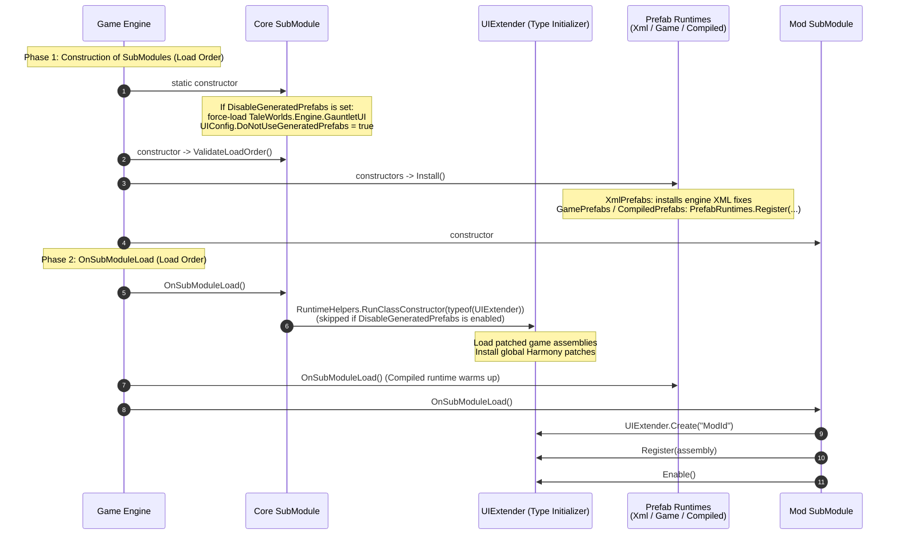
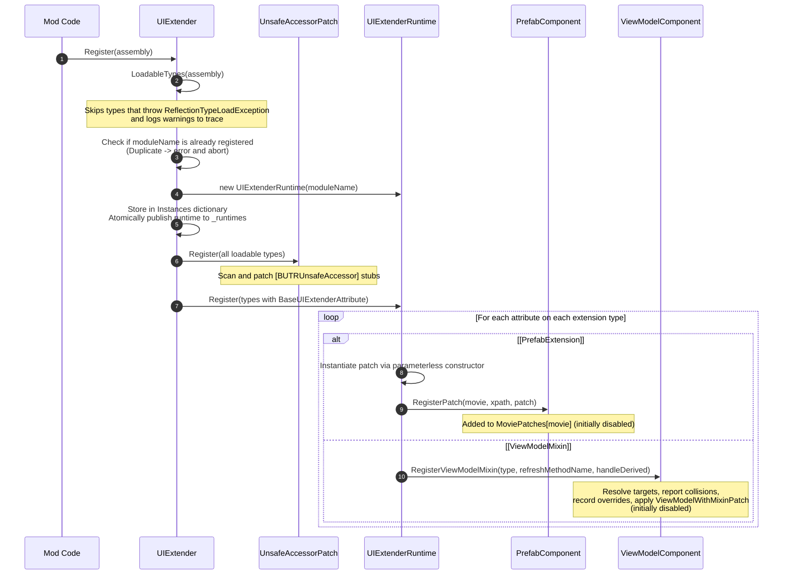

# Core Architecture: Lifecycle

> [!NOTE]
> This article is written for **UIExtenderEx maintainers and core contributors**.
> It details the execution lifecycle of the core library, from engine initialization through module registration, activation, and teardown.
> For the high-level architecture and type definitions, see [Overview](Overview.md).

A module's extensions transition through four lifecycle states:
1. **Registered:** Extension types (prefab patches, ViewModel mixins, accessor stubs) are discovered, instantiated, and validated. Necessary Harmony hooks are applied, but all extensions remain **inactive** (disabled).
2. **Enabled:** Patches and mixins are activated. The prefab cache is flagged to reload affected movies on their next instantiation, and newly created ViewModels attach active mixins.
3. **Disabled:** Patches and mixins are deactivated. Prefabs are invalidated for subsequent loads, and method overrides immediately stop intercepting execution.
4. **Deregistered:** The module's runtime state and caches are cleared, and the runtime is removed from the active execution list.

All process-wide infrastructure (assembly pre-loading, global Harmony patches, and prefab runtime discovery) is initialized before any mod registers its extensions.

---

## Startup Sequence

UIExtenderEx's `SubModule.xml` defines four separate `SubModule` entries executed in sequence:
1. **Core SubModule:** `Bannerlord.UIExtenderEx.SubModule`
2. **XML Prefab Runtime:** `Bannerlord.UIExtenderEx.XmlPrefabs.SubModule`
3. **Game Prefab Runtime:** `Bannerlord.UIExtenderEx.GamePrefabs.SubModule`
4. **Compiled Prefab Runtime:** `Bannerlord.UIExtenderEx.CompiledPrefabs.SubModule`

TaleWorlds' engine loads modules in two distinct phases: first invoking the constructor of every `SubModule` in dependency load order, followed by invoking `OnSubModuleLoad` on each in the same order. Because UIExtenderEx specifies load-before dependencies on `Native` and dependent mods, its lifecycle begins prior to standard game modules.

### Detailed Startup Steps

1. **Core Static Constructor:**
   - Evaluates the `DisableGeneratedPrefabs` setting.
   - If enabled, it force-loads `TaleWorlds.Engine.GauntletUI` and sets `UIConfig.DoNotUseGeneratedPrefabs = true`. This acts as an immediate compatibility escape hatch, restoring the pre-v3.0.0 behavior where all UI movies are parsed directly from XML.

2. **Core Constructor (`ValidateLoadOrder`):**
   - Verifies module load order using `ModuleInfoHelper.ValidateLoadOrder`.
   - If UIExtenderEx is placed improperly relative to its dependencies, it displays a diagnostic dialog prompting the user to terminate the process before corrupted state can propagate.

3. **Prefab Runtime Installation:**
   - In their constructors, the Game and Compiled runtimes install their baseline hooks and register via `PrefabRuntimes.Register(...)`. In contrast, `XmlPrefabs` only installs loader fixes and registers no runtime; any movie claimed by neither runtime falls back to the game's native XML loader.
   - Runtimes are queried in registration order (`SubModule.xml` order), ensuring the `GamePrefabRuntime` evaluates pristine prefabs before `CompiledPrefabRuntime` attempts code generation. See [Compiled Prefabs: Lifecycle](../compiled-prefabs/Overview.md#lifecycle--startup-sequence).

4. **Core `OnSubModuleLoad`:**
   - Executes `RuntimeHelpers.RunClassConstructor(typeof(UIExtender).TypeHandle)`.
   - This triggers `UIExtender`'s static constructor eagerly, ensuring that global Harmony hooks (specifically `GauntletMoviePatch`, which controls the movie switch) are active before the compiled runtime's background warm-up verifies engine capabilities via `PrefabRuntimes.IsMovieSwitchInstalled`.
   - If `DisableGeneratedPrefabs` is active, this eager initialization is skipped. In that case, `UIExtender`'s static constructor runs lazily upon the first call to `UIExtender.Create(...)`.

5. **Mod SubModule Initialization:**
   - Dependent mods create their extender instance, register their assemblies, and enable their extensions—typically inside their own `OnSubModuleLoad` method.
   - Modules with late-binding UI (such as MCM) may register during `OnBeforeInitialModuleScreenSetAsRoot`. Registering at a later stage is supported; newly registered prefab patches apply to all movies loaded thereafter, while mixins attach to ViewModels instantiated after activation.

---

## Registration Phase

Mod authors invoke `UIExtender.Register(Assembly)` or `UIExtender.Register(IEnumerable<Type>)` to declare their extensions.

### Key Registration Rules & Invariants

- **Registration Enables Nothing:**
  Every discovered prefab patch and ViewModel mixin is registered in a **disabled** state (`_enabledPatches[type] = false`, `_mixinTypeEnabled[type] = false`). A mod that calls `Register` without subsequent `Enable` introduces no behavior changes to the game.

- **Harmony Patches Apply During Registration:**
  Dynamic Harmony patches are applied immediately during `Register`, rather than deferred to `Enable`. This includes constructor, refresh, and finalize hooks on targeted ViewModel types (`ViewModelWithMixinPatch`), method overrides (`ViewModelOverridePatch`), and IL rewrite of `[BUTRUnsafeAccessor]` stubs. Deferring would incur unpredictable JIT overhead during gameplay; subsequent `Enable` and `Disable` calls simply toggle boolean flags.

- **Resilient Type Loading:**
  When loading types via `assembly.GetTypes()`, missing optional dependencies (e.g. a mixin targeting a DLC ViewModel on an installation where the DLC is absent) cause a `ReflectionTypeLoadException`. UIExtenderEx catches this exception, logs each loader failure to the trace diagnostics, and proceeds to register all successfully loaded types.

- **Global Unsafe Accessor Discovery:**
  All loadable types in the assembly are scanned for `[BUTRUnsafeAccessor]` stubs, not just classes marked with extension attributes. This allows developers to place private accessor stubs within utility or helper classes.

- **Early Runtime Publication:**
  The `UIExtenderRuntime` instance is appended to the lock-free `_runtimes` array before its types are registered. Because all newly registered components start disabled, ongoing game engine operations can safely query the published list without observing uninitialized or half-configured extensions.

- **Constructor Requirements for Prefab Patches:**
  Prefab patch classes must define a public parameterless constructor and inherit from one of the supported patch base classes. If a constructor is missing or unsupported, UIExtenderEx emits a failure diagnostic via `MessageUtils.Fail`.

- **Diagnostics Channeling:**
  Issues with mixin declarations (such as abstract target types without `HandleDerived = true`, member name collisions, or malformed override signatures) are written to the diagnostic trace log rather than shown to end users. The only exception is when a mixin's target ViewModel cannot be determined; this triggers `MessageUtils.Fail`, which logs the failure and displays a red in-game message. These issues are flagged to mod developers at compile time via Roslyn analyzers. See [Mixin Hooks: What registration reports](../v3/Mixins.md#what-registration-reports).

- **Unique Module Name Enforcement:**
  A given module name can only be registered once. Attempting to register an already-registered name displays an error message and aborts without creating a runtime.

---

## Enable and Disable

The `Enable()` and `Disable()` methods control the active state of registered extensions:

| Method Call | `ViewModelComponent` Impact | `PrefabComponent` Impact |
| :--- | :--- | :--- |
| `Enable()` / `Disable()` | Sets `_mixinTypeEnabled[type]` for all registered mixins, then raises `PrefabSource.EnvironmentChanged`. | Sets `_enabledPatches[type]` for all registered patches, then calls `WidgetFactoryManager.ReloadOnNextUse` for all patched movies. |
| `Enable(Type)` / `Disable(Type)` | Updates the enable flag for the specified mixin type (if present), then raises `EnvironmentChanged`. | Updates the enable flag for the specified patch type (if present), then reloads affected movies via `ReloadOnNextUse`. |

The single-type overloads (`Enable(Type)` / `Disable(Type)`) query both components sequentially. The component that does not recognize the type silently ignores the request.

### Impact on Active UI and Instantiated Objects

Toggling extension state does not retroactively modify screens or widgets currently rendered:

- **Prefab Invalidation:**
  `WidgetFactoryManager.ReloadOnNextUse(movieNames)` evicts cached prefab templates from the game's internal `_liveCustomTypes` and `_liveInstanceTracker` tables and raises `PrefabSource.ReloadRequested`. The next time a UI movie requires that prefab, it re-parses the XML document with the patches currently enabled. UI screens that are already open remain undisturbed.

- **ViewModel Mixin Attachment:**
  Only `ViewModel` instances constructed **after** `Enable()` receive newly activated mixins. ViewModels instantiated while a mixin was disabled will not possess the mixin. Conversely, ViewModels that already have an attached mixin retain it even after `Disable()`, continuing to receive `OnRefresh` and `OnFinalize` callbacks.

- **Immediate Method Override Cutoff:**
  `[BUTRViewModelOverride]` methods are the exception to the above retention rule. The override execution chain checks `_mixinTypeEnabled` dynamically on every invocation. Consequently, calling `Disable()` immediately causes method overrides to bypass the mixin and invoke the base game method.

- **Prefab Runtime Cache Invalidation:**
  Raising `PrefabSource.EnvironmentChanged` and `PrefabSource.ReloadRequested` notifies the compiled prefab runtime (`CompiledPrefabs`) that cached pre-compiled assemblies may be out of date, triggering recompilation or cache eviction as needed.

---

## Deregister

When a mod shuts down or unloads, it calls `UIExtender.Deregister()`. This cleanly reverses the registration process:

1. **Prefab State Cleanup:**
   `PrefabComponent.Deregister()` captures the list of movies modified by its patches, clears its internal patch tables, and calls `WidgetFactoryManager.ReloadOnNextUse(movies)`. This ensures subsequent movie loads parse clean XML without this module's modifications.
2. **ViewModel State Cleanup:**
   `ViewModelComponent.Deregister()` clears its mixin registries, property/method reflection caches, and override dictionaries, then triggers `PrefabSource.RaiseEnvironmentChanged()`.
3. **Runtime Retirement & Instance Removal:**
   The `UIExtender` instance is removed from `Instances`, and its `UIExtenderRuntime` is atomically removed from `UIExtender._runtimes`. The module name is released, allowing it to be registered again if needed.

### What Persists After Deregistration

To avoid unstable Harmony unpatching during runtime execution, certain elements persist safely:

- **Shared Harmony Hooks:**
  The Harmony hooks on `ViewModel` constructors, `OnFinalize`, and refresh methods remain installed. These hooks iterate over active runtimes and perform no work for types without registered mixins. Accessor stubs retain their generated IL implementations.

- **Active Mixins on Existing ViewModels:**
  Any `ViewModel` instance that already instantiated a mixin retains that mixin until the ViewModel is garbage collected. While property refreshes and method overrides cease execution, mixins must still be cleaned up when the ViewModel closes.
  
  To ensure `OnFinalize()` and event unsubscriptions still execute, the deregistered `ViewModelComponent` is added to a static collection: `ViewModelComponent.Retired`. The global finalize hook queries active runtimes first, followed by `ViewModelComponent.Retired`. Because per-instance state is held in a `ConditionalWeakTable`, references automatically evaporate when ViewModels are collected, leaving behind only empty dictionary shells.
