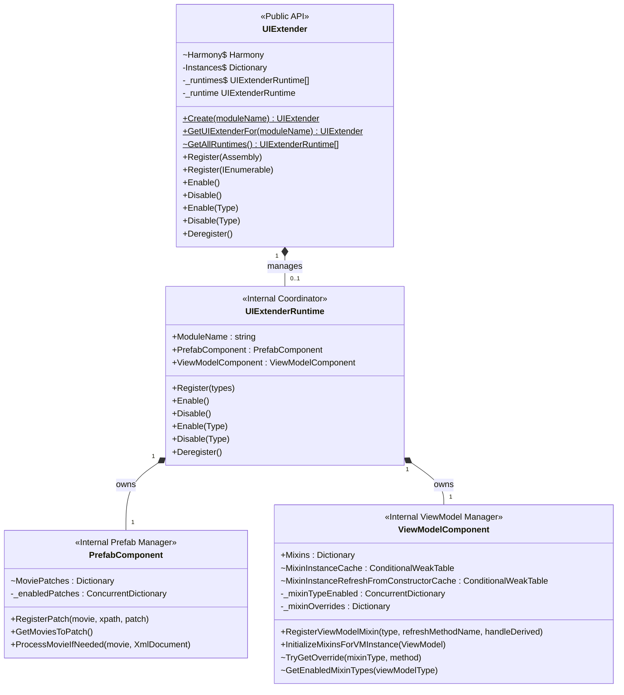

# Core Architecture: Overview

> [!NOTE]
> This article is written for **UIExtenderEx maintainers and core contributors**.
> Mod authors looking for general usage guidelines and tutorials should start with the [General Overview](../general/Overview.md) and the [API documentation](../v2/Overview.md) instead.
> For details on the runtime compilation pipeline that compiles UI movies into C# assemblies, see [Compiled Prefabs: Architecture](../compiled-prefabs/Overview.md).

The core assembly, `Bannerlord.UIExtenderEx.dll`, provides the foundational infrastructure of UIExtenderEx. It manages the registration of mod UI extensions, installs the Harmony patches required to intercept and extend TaleWorlds' Gauntlet UI engine, coordinates prefab XML modifications and ViewModel mixins, and exposes the runtime hosting APIs used by specialized prefab runtimes.

This section covers the core architecture across four dedicated articles:

- **[Overview](Overview.md)**: Architectural layers, global Harmony patches, the `Runtimes` hosting seam, configuration, and threading models.
- **[Lifecycle](Lifecycle.md)**: Engine initialization, registration sequence, enabling/disabling extensions, and clean teardown.
- **[Prefab Patching](PrefabPatching.md)**: How XML patches are intercepted, applied, cached, and coordinated with the prefab system.
- **[ViewModel Patching](ViewModelPatching.md)**: How mixins, property bindings, method overrides, and accessor stubs are attached to ViewModels.

> [!TIP]
> **Disambiguating "Runtime":**
> In this codebase, the term *runtime* has two distinct meanings:
> 1. **`UIExtenderRuntime` (Core Runtime):** The internal per-module container managing a mod's registered patches, mixins, and activation states.
> 2. **Prefab Runtime ([`IPrefabRuntime`](xref:Bannerlord.UIExtenderEx.Runtimes.IPrefabRuntime)):** A movie loading strategy that determines how a UI movie is constructed—such as the game's native pre-compiled prefabs (`GamePrefabs`), UIExtenderEx's dynamic Roslyn-compiled prefabs (`CompiledPrefabs`), or the XML prefab parser (`XmlPrefabs`).

---

## Architectural Layers: Process-Wide vs. Per-Module

To achieve maximum performance and avoid redundant hooks, the core divides its responsibilities into two distinct architectural layers:

1. **Process-Wide Layer (Static & Global):**
   - Managed globally by static members on [`UIExtender`](xref:Bannerlord.UIExtenderEx.UIExtender).
   - Initializes a single, shared Harmony instance (`bannerlord.uiextender.ex`).
   - Pre-loads required TaleWorlds assemblies and installs global engine hooks (intercepting movie loading, prefab deserialization, brush/widget managers, etc.).
   - Maintains an immutable, lock-free array of all active module runtimes (`UIExtender.GetAllRuntimes()`).
   - Exposes the host `Runtimes` API to pluggable prefab runtime assemblies.

2. **Per-Module Layer (Scoped & Isolated):**
   - Each mod obtains an isolated [`UIExtender`](xref:Bannerlord.UIExtenderEx.UIExtender) instance via `UIExtender.Create("ModId")`.
   - Registering an extender creates an internal `UIExtenderRuntime`, composed of two specialized components:
     - `PrefabComponent`: Stores the mod's prefab patches, XPath selectors, and per-patch enable states.
     - `ViewModelComponent`: Stores the mod's ViewModel mixins, method overrides, accessor stubs, and mixin enable states.
   - When a global hook triggers, it iterates through all registered runtimes in registration order. If a mod does not target a particular movie or ViewModel, it incurs no processing overhead.

### ABI Stability and Internal Encapsulation

[`UIExtender`](xref:Bannerlord.UIExtenderEx.UIExtender) is the sole public-facing type in the core runtime registration pipeline. Its public methods (`Create`, `Register`, `Enable`, `Disable`, `Deregister`) define the binary interface (ABI) used by mod assemblies and must remain strictly backwards-compatible.

In contrast, `UIExtenderRuntime`, `PrefabComponent`, and `ViewModelComponent` are entirely internal. Their data structures, caching mechanisms, and method signatures can be refactored freely without breaking dependent mods.

---

## Global Harmony Patches

During engine startup, [`UIExtender`](xref:Bannerlord.UIExtenderEx.UIExtender)'s static constructor initializes the global patching layer. 

### Assembly Pre-Loading

Because Harmony patch target resolution searches only among assemblies currently loaded in the `AppDomain`, and TaleWorlds loads UI assemblies on-demand (for example, `TaleWorlds.GauntletUI.Data` is not loaded until the first UI movie is requested), `UIExtender` first executes `LoadPatchedAssemblies()`. This method explicitly forces the loading of required assemblies:
- `TaleWorlds.Library`
- `TaleWorlds.GauntletUI`
- `TaleWorlds.GauntletUI.PrefabSystem`
- `TaleWorlds.GauntletUI.Data`
- `TaleWorlds.Engine.GauntletUI`

If any assembly fails to load, UIExtenderEx logs a warning and informs the user, while continuing to load remaining components.

### Global Engine Patches

Once target assemblies are available, UIExtenderEx applies its primary suite of engine patches using a single shared `Harmony` instance (`bannerlord.uiextender.ex`):

| Patch | Target Method | Patch Type | Purpose |
| :--- | :--- | :--- | :--- |
| `GauntletMoviePatch` | `GauntletMovie.Load` | Prefix | **Movie Load Interception:** Acts as the movie switch. Queries registered [`IPrefabRuntime`](xref:Bannerlord.UIExtenderEx.Runtimes.IPrefabRuntime) instances (Game and Compiled—`XmlPrefabs` registers none) to determine whether a pre-compiled or compiled variant can serve the movie. Falls back to the game's XML loader if neither runtime claims it. See [Pipeline](../compiled-prefabs/Pipeline.md#1-the-movie-load-decision). |
| `WidgetPrefabPatch` | `WidgetPrefab.LoadFrom` | Transpiler + Reverse Patch | **XML Patch Application:** Transpiles the game's file loader to inject `ProcessMovie`, executing all registered mod XML patches immediately after the XML document is loaded from disk. Provides a reverse patch (`LoadFromDocument`) allowing prefabs to be built directly from mod-supplied `XmlDocument` instances. See [Prefab Patching](PrefabPatching.md). |
| `ParsePatch` | `ConstantDefinition.GetValue` | Transpiler | **Culture Invariant Parsing:** Forces decimal constants in prefab XML to parse using `CultureInfo.InvariantCulture`, preventing crashes and layout corruption on systems configured with comma decimal separators. |
| `ViewModelPatch` | `ViewModel.ExecuteCommand` | Prefix | **Internal ViewModel Extensions:** Forwards commands to the instance an internal `ViewModelWrapper` wraps. See [ViewModel Patching: Internal ViewModel Types](ViewModelPatching.md#internal-viewmodel-types). |
| [`BrushFactoryManager`](xref:Bannerlord.UIExtenderEx.ResourceManager.BrushFactoryManager) | `BrushFactory..ctor` `BrushFactory.LoadBrushes` | Postfix | **Custom Brush Registration:** Injects runtime-registered brushes into the brush factory's internal lookup tables upon creation and whenever brushes are reloaded. |
| [`WidgetFactoryManager`](xref:Bannerlord.UIExtenderEx.ResourceManager.WidgetFactoryManager) | `WidgetFactory.GetCustomType` `WidgetFactory.IsCustomType` `WidgetFactory.CreateBuiltinWidget` `WidgetFactory.GetWidgetTypes` `WidgetFactory.OnUnload` | Prefix / Postfix | **Custom Widget & Prefab Serving:** Intercepts widget factory queries to inject mod-registered custom widget types, custom prefabs, and handle resource reference counting and lifecycle cleanup. |
| `EventManagerPatch` | `EventManager.OnWidgetDisconnectedFromRoot` (1.3.12+) `EventManager.UnRegisterWidgetForEvent` (up to 1.3.11) | Transpiler | **Engine Leak Fix:** Fixes engine bugs where widgets stay registered in the visual definition (and `TweenPosition`) update tables after they no longer belong there. From 1.3.12, widgets with a visual definition stay registered after disconnection from the UI root; up to 1.3.11, widgets whose visual definition is taken away stay registered, also after disconnection. |
| `UIConfigPatch` | `UIConfig.DoNotUseGeneratedPrefabs` (setter) `UIConfig.SetUsingGeneratedPrefabs` | Postfix | **Configuration Synchronization:** Listens for changes to the game's pre-compiled prefab flag (triggered via code or console commands) and syncs the state with UIExtenderEx's persistent settings. |

### Patch Resilience and Safe Execution

Global patches are installed through an internal `TryPatch` helper. Each patch is treated as an isolated unit:
- If a patch fails to apply (e.g. if an engine update alters a method signature), an in-game warning notification or trace diagnostic is emitted detailing which feature will be disabled.
- Failure of one patch does not prevent subsequent patches from installing.
- Transpilers locate instructions by pattern matching IL opcode sequences rather than assuming fixed instruction offsets. If a target pattern cannot be resolved, the original method body is left intact.

### Per-Registration (Dynamic) Patches

In addition to the global patches installed once at startup, UIExtenderEx dynamically applies targeted Harmony patches as mods register mixins and extensions:

| Dynamic Patch | Application Trigger | Purpose |
| :--- | :--- | :--- |
| `ViewModelWithMixinPatch` | Applied once per `ViewModel` type targeted by a mixin | Hooks constructors, `OnFinalize`, and the designated refresh method (`RefreshValues` or custom) to instantiate, refresh, and dispose attached mixin instances. |
| `ViewModelOverridePatch` | Applied once per `ViewModel` method targeted by a `[BUTRViewModelOverride]` | Replaces the target method with a chain of delegates, allowing mixin methods to intercept, alter, or replace the original method execution. |
| `UnsafeAccessorPatch` | Applied once per `[BUTRUnsafeAccessor]` stub | Transpiles stub methods into high-performance IL instructions (`call`, `callvirt`, `ldflda`, `ldsflda`) that bypass member accessibility checks. |

---

## The `Runtimes` Hosting Seam

The [`Bannerlord.UIExtenderEx.Runtimes`](xref:Bannerlord.UIExtenderEx.Runtimes) namespace defines the public contract between the core assembly and specialized prefab runtime implementations (`XmlPrefabs`, `GamePrefabs`, and `CompiledPrefabs`).

Runtimes are compiled into separate assemblies to decouple the core modding API from heavy dependencies (such as Roslyn compiler packages). The core defines the hosting contracts; runtimes consume them.

| Seam Type | Description and Role |
| :--- | :--- |
| [`IPrefabRuntime`](xref:Bannerlord.UIExtenderEx.Runtimes.IPrefabRuntime) / [`PrefabRuntimes`](xref:Bannerlord.UIExtenderEx.Runtimes.PrefabRuntimes) | Manages the ordered registry of prefab runtimes (derived from `SubModule.xml` load order). Exposes engine capabilities such as `IsMovieSwitchInstalled` (verifying `GauntletMoviePatch` is active) and `DottedAttributePathsResolve` (indicating dotted property path support). |
| [`PrefabSource`](xref:Bannerlord.UIExtenderEx.Runtimes.PrefabSource) | Central event bus and source of truth for prefab data. Raises `Parsed`, `Registered`, `ReloadRequested`, and `EnvironmentChanged` events. Tracks patched prefab names and runtime-registered widgets/brushes. |
| [`MixinSource`](xref:Bannerlord.UIExtenderEx.Runtimes.MixinSource) | Provides access to active mixin types registered for a given `ViewModel` type in binding resolution order. |
| [`ViewModelSource`](xref:Bannerlord.UIExtenderEx.Runtimes.ViewModelSource) | Exposes member resolution helpers so prefab runtimes can resolve property bindings and commands against live `ViewModel` instances. |
| [`RuntimeSettings`](xref:Bannerlord.UIExtenderEx.Runtimes.RuntimeSettings) | Exposes core module configuration flags (such as whether compiled prefabs or debug dumps are enabled) to runtime assemblies. |

Additionally, [`ViewModelMixins.Get<TMixin>()`](xref:Bannerlord.UIExtenderEx.ViewModels.ViewModelMixins.Get*) and [`ViewModelMixins.Select()`](xref:Bannerlord.UIExtenderEx.ViewModels.ViewModelMixins.Select*) in the `Bannerlord.UIExtenderEx.ViewModels` namespace provide the public runtime lookup mechanism that compiled prefab C# code uses to resolve mixin instances from bound ViewModels.

---

## Configuration and Settings

UIExtenderEx settings are defined in the `<Settings>` section of the module's `SubModule.xml` and loaded via `SettingsSubModuleXml`. When Mod Configuration Menu (MCM) is present, it exposes these settings in the user interface and writes changes directly back to `SubModule.xml`. The configuration file is automatically reloaded when its last-modified timestamp changes.

| Setting | Consumed By | Architectural Effect |
| :--- | :--- | :--- |
| `DisableGeneratedPrefabs` | `SubModule` (Static constructor) | Sets `UIConfig.DoNotUseGeneratedPrefabs = true`. Forces all UI movies to load via XML, restoring pre-v3.0.0 behavior. Used primarily as a compatibility escape hatch. |
| `DumpXML` | `PrefabComponent.ProcessMovieIfNeeded` | Diagnostic dump: saves the fully patched XML document of every movie to `<UIExtenderEx Module>/Dumps/<movie>_<moduleName>.xml`. |
| `CompiledPrefabs` | `GameCompiledPrefabEnvironment.IsEnabled` | Enables runtime C# source code generation, Roslyn background compilation, and dynamic prefab assembly caching. |
| `DumpGeneratedCode` | `Bannerlord.UIExtenderEx.CompiledPrefabs` | Emits generated C# source code files to disk for debugging and inspection. |
| `RecordTimings` | `GameCompiledPrefabEnvironment.RecordTimings` | `PrefabTimings` writes every movie load (timed by `GauntletMovieTimingPatch`) and the compile, load and warm-up timings to `CompiledPrefabs/Timings/`, one tab-separated file per session. |

---

## Concurrency and Thread Safety

Because UI movie loading and prefab parsing can occur concurrently across multiple threads (e.g. background worker threads, asynchronous compilation, and scene transitions), the core runtime enforces strict thread-safety invariants:

### Lock-Free Published Snapshots

Static runtime registries—such as `UIExtender._runtimes` and `PrefabRuntimes._runtimes`—use an **atomic published array** pattern:
- **Write Path:** When a mod registers or deregisters, a new array is constructed and published atomically using `Volatile.Write`.
- **Read Path:** Calling `UIExtender.GetAllRuntimes()` performs a lock-free snapshot via `Volatile.Read`.
- **Performance:** Because ViewModel constructors, refresh hooks, and finalize callbacks query the active runtimes continuously, iteration operates over a fixed array reference with index loops. This incurs zero heap allocations and ensures readers never observe partially populated lists.

### Concurrent Lookups and Instance Lifetimes

- **Thread-Safe Dictionaries:** Component-level lookups and patch enablement flags use `ConcurrentDictionary<TKey, TValue>`, allowing safe concurrent access across worker and UI threads.
- **Garbage Collection Safety:** Instance-level state (such as `MixinInstanceCache` and deferred constructor refresh queues in `ViewModelComponent`) is stored in `ConditionalWeakTable<TKey, TValue>`. This guarantees that mixin instances and caches are automatically cleaned up when the owning `ViewModel` is garbage collected, preventing memory leaks.
- **Main-Thread Registration:** The top-level `UIExtender.Instances` registry uses a standard `Dictionary<string, UIExtender>` because mod registration and deregistration occur sequentially during module startup (`OnSubModuleLoad`) on the main thread.
