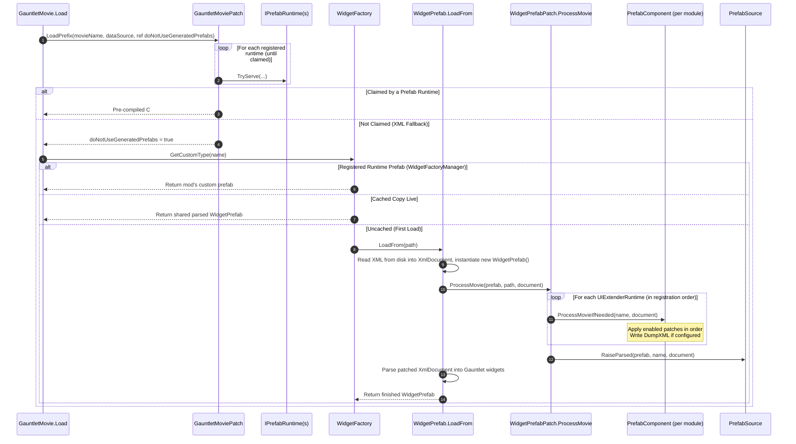

# Core Architecture: Prefab Patching

> [!NOTE]
> This article is written for **UIExtenderEx maintainers and core contributors**.
> For authoring prefab patches as a mod developer, see the [APIv2 Documentation](../v2/Overview.md).

UIExtenderEx's prefab patching engine intercepts and modifies Gauntlet UI prefab XML documents before they are parsed into widget trees. Because every prefab runtime—whether the native XML loader, the game's pristine pre-compiled prefabs, or UIExtenderEx's Roslyn-compiled prefabs—derives its structure and fingerprint from this patched XML, modifications remain identical regardless of which runtime serves the movie.

---

## Registration

During module registration, `UIExtenderRuntime.Register` inspects types decorated with `[PrefabExtension]` attributes. It instantiates each patch class via its public parameterless constructor and passes it to the corresponding `PrefabComponent.RegisterPatch` overload.

Each overload encapsulates the patch execution into an `Action<XmlDocument>` and records it as a `PrefabPatch(Type, Patcher)` entry inside `MoviePatches[movieName]`, initially in a **disabled** state.

### Supported Patch Types

| Patch Class | Target Selection | Operation |
| :--- | :--- | :--- |
| `Prefabs2.PrefabExtensionInsertPatch` | Node selected by XPath | Injects nodes according to `InsertType` (`Child`, `Prepend`, `Append`, `ReplaceKeepChildren`, `Replace`), or deletes the target node (`Remove`). |
| `Prefabs2.PrefabExtensionSetAttributePatch` | Node selected by XPath | Sets or replaces XML attributes on the target element. It cannot remove one. |
| `Prefabs.PrefabExtensionInsertPatch` *(v1 Obsolete)* | Node selected by XPath | Inserts content at a specified child index (`Position`). |
| `Prefabs.PrefabExtensionReplacePatch` *(v1)* | Node selected by XPath | Replaces the selected node and its children with new content. |
| `Prefabs.PrefabExtensionInsertAsSiblingPatch` *(v1)* | Node selected by XPath | Inserts content as an adjacent sibling (`Append` or `Prepend`). |
| `Prefabs.PrefabExtensionSetAttributePatch` *(v1)* | Node selected by XPath | Sets a single XML attribute on the target node. |
| `Prefabs.CustomPatch<XmlNode>` | Node selected by XPath | Invokes custom callback `Apply(XmlNode)` on the selected element. |
| `Prefabs.CustomPatch<XmlDocument>` | Whole XML document | Invokes custom callback `Apply(XmlDocument)`; XPath selector is ignored. |

To maintain unified internal behavior, legacy v1 patches are automatically translated into v2 node placements (`PlaceNodes`). Both APIs share the same underlying execution pipeline.

### XPath Evaluation and XML Sanitization

- **Target Node Resolution:**
  XPath expressions are evaluated against the document using `SelectSingleNode`. Only the first matching node is modified. If no matching node is found, UIExtenderEx logs a trace diagnostic, displays an in-game notification ("Failed to apply extension to `<movie>`: node at `<xpath>` not found"), and skips the patch without crashing the game.
- **Automatic XML Comment Removal:**
  Gauntlet UI's native XML parser crashes if injected XML fragments contain XML comment nodes (`<!-- ... -->`). UIExtenderEx's insertion pipeline recursively strips all comment nodes before appending content to the active document.
- **Structural Integrity Validation:**
  Operations that break XML document validity—such as attempting to remove the document root element or inserting multiple root elements into a document—are caught and routed through `MessageUtils.Fail`.
- **Target Movie Keys:**
  The `movie` parameter refers to the **prefab name** (the XML filename without its `.xml` extension). Consequently, a patch targeting a prefab applies wherever that prefab is parsed—whether as a top-level movie or as an inlined nested prefab embedded inside another movie.

---

## Patch Execution Pipeline

The prefab patching pipeline intercepts Gauntlet UI movie loading and injects XML transformations seamlessly:

### Detailed Pipeline Stages

1. **Movie Load Interception (`GauntletMoviePatch`):**
   `GauntletMoviePatch.LoadPrefix` evaluates whether a pre-compiled variant may be served. The `GamePrefabRuntime` claims a movie only if no mod patches, overrides, or custom registrations touch any prefab in its dependency tree. The `CompiledPrefabRuntime` claims a movie only if a cached assembly matching the current patched XML fingerprint exists. If neither claims it, `doNotUseGeneratedPrefabs` is set to `true`, forcing the engine through the XML loader.
2. **`LoadFrom` Transpiler Hook (`WidgetPrefabPatch`):**
   When `WidgetPrefab.LoadFrom` executes, a Harmony transpiler locates the `newobj WidgetPrefab` instruction following file reading and inserts a call to `ProcessMovie(prefab, path, document)`. The XML document and path parameters are discovered dynamically by type.
3. **Patch Execution (`ProcessMovieIfNeeded`):**
   `ProcessMovie` iterates across all live runtimes (`UIExtender.GetAllRuntimes()`) in registration order. If a module contains enabled patches for the prefab, they are executed sequentially. Because runtimes are processed in registration order, later mods observe and build upon modifications made by earlier mods.
4. **Diagnostic XML Dumps:**
   If the `DumpXML` configuration flag is enabled, the fully patched `XmlDocument` is written to `<UIExtenderEx Module>/Dumps/<movie>_<moduleName>.xml` for troubleshooting and inspection.
5. **Publication (`PrefabSource.Parsed`):**
   Once all patches are applied, `PrefabSource.RaiseParsed` is emitted for every parsed prefab (whether patched or untouched). `CompiledPrefabRuntime` listens to this event to record and hash each prefab's XML in `PrefabXmlRegistry`, while `PrefabXmlDump` writes the XML to disk if the `UIEXTENDEREX_DUMP_PREFABS` environment variable is set. Neither subscriber triggers compilation; code generation begins only when a movie load cannot find a matching cached build (see [Pipeline](../compiled-prefabs/Pipeline.md#4-execution-flow-of-tryusecompiledprefab)).
6. **Engine Parsing:**
   The game engine parses the now-modified `XmlDocument` into its internal widget tree.

### Shared Templates and Cache Eviction

`WidgetFactory` caches parsed `WidgetPrefab` templates in `_liveCustomTypes` and `_liveInstanceTracker`, sharing them across all active movies that reference them. Critical UI elements (such as tooltips and standard headers) are retained in memory indefinitely.

To ensure newly enabled or disabled patches take effect, `UIExtender.Enable()`, `Disable()`, and `Deregister()` invoke `WidgetFactoryManager.ReloadOnNextUse(movieNames)`. This method:
- Evicts the specified prefab names from the factory's live template caches and UIExtenderEx's tracking tables.
- Fires `PrefabSource.ReloadRequested` so the compiled runtime can invalidate stale builds.
- Forces the next UI movie referencing the prefab to re-execute `LoadFrom` and re-apply active patches.
- Leaves already-rendered screens undisturbed.

---

## Runtime Registrations: Prefabs, Widgets, and Brushes

Mods can introduce UI resources dynamically in memory without placing XML files on disk via `WidgetFactoryManager` and `BrushFactoryManager`.

| API | Mechanism & Architecture |
| :--- | :--- |
| `WidgetFactoryManager.Register(name, Func<WidgetPrefab?>)` `CreateAndRegister(name, XmlDocument)` | **Dynamic Prefabs:** Hooks `WidgetFactory.IsCustomType` and `GetCustomType` via Harmony prefixes to serve custom prefabs, overriding any game prefab of the same name. Manages reference counting and lifecycle cleanup through an `OnUnload` hook. Registration clears existing factory copies and raises `PrefabSource.Registered`. |
| `WidgetFactoryManager.Create(name, XmlDocument)` | **In-Memory Prefab Creation:** Constructs a `WidgetPrefab` directly from an `XmlDocument` via `LoadFromDocument`. This uses a Harmony reverse patch that replaces file I/O with in-memory document assignment. Because reverse patches bypass the transpiler hook, `LoadFromDocument` clones the document, applies enabled patches directly, and raises `PrefabSource.Parsed`. |
| `WidgetFactoryManager.Register(Type widgetType)` | **Custom C# Widget Classes:** Injects custom widget classes into Gauntlet UI. Hooks `WidgetFactory.CreateBuiltinWidget` to construct the widget via its `(UIContext)` constructor, adds the type to `WidgetInfoTable`, and includes it in `GetWidgetTypes`. Raises `PrefabSource.EnvironmentChanged`. |
| `BrushFactoryManager.Register` `CreateAndRegister` | **Custom Brushes:** Injects mod brushes directly into each `BrushFactory._brushes` internal dictionary upon factory instantiation and after `LoadBrushes` reloads. Native game brushes with conflicting names take precedence. |

### Resolving JIT Inlining Conflicts

In the .NET runtime, small methods such as `BrushFactory.GetBrush`, `WidgetFactory.IsCustomType`, and `WidgetFactory.OnUnload` are frequently inlined by the JIT compiler into calling methods compiled prior to mod initialization (e.g. `WidgetTemplate.CreateWidgets`, `WidgetTemplate.OnRelease`, and `GauntletMovie.Release`). If inlined, standard Harmony prefixes on those methods would never be reached.

UIExtenderEx overcomes this through two distinct strategies:
- **Direct Table Injection for Brushes:** Rather than patching lookup methods, brushes are inserted directly into `BrushFactory._brushes`. Inlined reads retrieve the mod's brushes seamlessly from the dictionary.
- **De-inlining via Transpilers for Widgets:** `WidgetFactoryManager` applies an empty Harmony transpiler to caller methods (`WidgetTemplate.CreateWidgets`, `WidgetTemplate.OnRelease`, `GauntletMovie.Release`). Under Harmony, applying a patch causes the target method to be re-compiled by the JIT with `MethodImplOptions.NoInlining` enforced, guaranteeing that the prefix hooks on `IsCustomType` and `OnUnload` are executed. Automated unit tests (`PatchInliningTests`) verify that all caller methods remain tracked.

---

## Engine XML Loader Fixes

UIExtenderEx applies targeted engine patches to resolve native TaleWorlds Gauntlet UI bugs and limitations:

- **Invariant Culture Parsing (`ParsePatch`):**
  TaleWorlds' native `ConstantDefinition.GetValue` parses numeric constants using the current thread culture. On systems configured with comma decimal separators (e.g. European locales), decimal values such as `1.5` failed to parse or produced corrupt layout coordinates. `ParsePatch` transpiles the parsing call to force `CultureInfo.InvariantCulture`.
- **Dotted Attribute Paths (`WidgetExtensionsPatch` in `XmlPrefabs`):**
  Bannerlord's XML parser natively supported attribute property paths up to two segments deep. `WidgetExtensionsPatch` extends this to arbitrary depths, allowing nested widget attribute paths like `Brush.Font.CustomScale` to resolve. (Note that these refer strictly to widget properties, not ViewModel paths.) The runtime publishes this capability via `PrefabRuntimes.DottedAttributePathsResolve`.
- **Template Child Allocation Leak (`WidgetTemplatePatch` in `XmlPrefabs`):**
  In native Gauntlet UI, instantiating a custom widget template repeatedly appended child elements to `_customTypeChildren` without deduplication. On widget release, the engine traversed this list, resulting in quadratic overhead and memory leaks. `WidgetTemplatePatch` prevents duplicate registrations.

