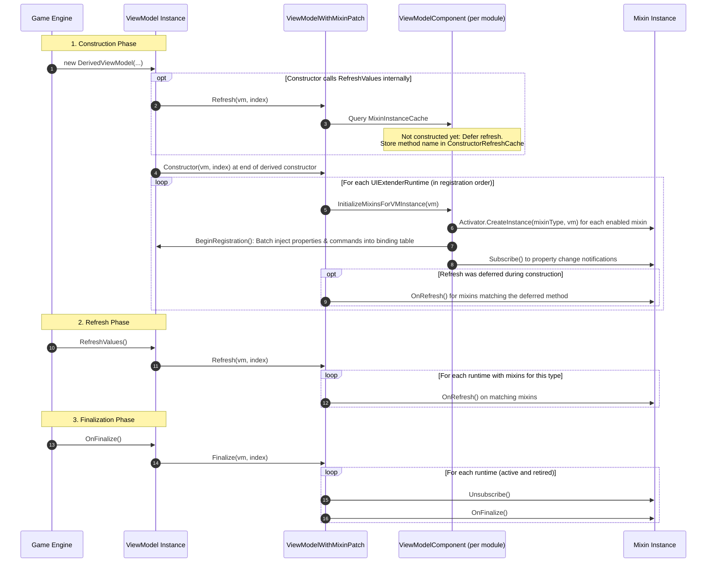

# Core Architecture: ViewModel Patching

> [!NOTE]
> This article is written for **UIExtenderEx maintainers and core contributors**.
> For guides on writing mixins as a mod author, see [ViewModel Mixin](../v2/ViewModelMixin.md) and [Mixin Hooks](../v3/Mixins.md).

A ViewModel mixin is an object attached dynamically to each instance of a target Gauntlet UI `ViewModel`. Its properties (`[DataSourceProperty]`) and methods (`[DataSourceMethod]`) are registered into that instance's runtime binding table, allowing Gauntlet UI prefab movies to bind to mixin properties and commands as if they were natively declared on the ViewModel.

Mixins are instantiated at the conclusion of the ViewModel's constructor, refreshed following its refresh method, and finalized when the ViewModel is destroyed.

---

## Registration

When an extension assembly is registered, `ViewModelComponent.RegisterViewModelMixin(mixinType, refreshMethodName, handleDerived)` processes each declared mixin through the following stages:

1. **Target ViewModel Resolution:**
   Resolves the target ViewModel type from the type argument of `BaseViewModelMixin<TViewModel>` in the mixin's inheritance hierarchy. For mixins implementing `IViewModelMixin` directly, it falls back to a heuristic: it traverses the base-class hierarchy and takes the first generic type argument of the first generic class that implements `IViewModelMixin`.
2. **Abstract Target Validation:**
   Because mixins attach strictly to concrete instances at runtime and abstract classes cannot be instantiated, registering a mixin targeting an abstract type without `handleDerived = true` is rejected. A diagnostic warning is logged to the trace output.
3. **Inheritance Expansion (`handleDerived`):**
   When `handleDerived` is enabled, UIExtenderEx queries `AccessTools2.AllTypes()` for all loaded types assignable to the target type. Each derived concrete type is registered as an independent target. *(Note: This discovery occurs at registration time; ViewModel classes loaded by assemblies dynamically at a later point are not automatically discovered).*
4. **Collision Detection & Reporting:**
   Member collisions are analyzed and reported to the trace log:
   - If a mixin declares a member with the same name as a member on the target ViewModel, the mixin's member takes precedence for prefab bindings and UI commands, while game C# code continues to access the ViewModel's member directly.
   - If multiple mixins target the same ViewModel and define conflicting member names, the mixin registered latest wins.
5. **Method Override Registration:**
   Discovers and registers any `[BUTRViewModelOverride]` methods declared on the mixin (see [Method Overrides](#method-overrides)).
6. **Patch Application & State Recording:**
   Records the mixin type in `Mixins[target]` in a **disabled** state, and calls `ViewModelWithMixinPatch.Patch(target, refreshMethodName)`.

### Why mixin members are flat

Mixin members are merged directly into the target ViewModel's root binding table. While two mods can collide on a property name, or a mixin member can collide with an existing ViewModel member, registration detects and reports these collisions rather than forbidding them. An alternative scoped model—where each mixin is mounted as an independent child ViewModel (e.g. `DataSource="{MyMixin}"`)—would eliminate collisions, but was evaluated and rejected for 3.0 for several key reasons:

- **Incompatibility with vanilla widget property binding:** `GauntletView.BindData` resolves `path.LastNode` against the widget's immediate ViewModel. Consequently, binding `@MyMixin\IsVisible` on a vanilla widget actually looks up `IsVisible` on the parent host. Only commands traverse the full path (`GauntletView.OnCommand` walks `Path.ParentPath`). In a 2026-09 survey of 125 distinct mixins on GitHub, multiple mods bind mixin properties directly onto vanilla widgets (most commonly a panel's `IsVisible`).
- **Host-level notification dispatch:** Many existing mixins raise change notifications directly through the host ViewModel via `ViewModel.OnPropertyChanged(...)`. Isolating mixins into child scopes would cause these notifications to silently fail without raising an error.
- **Migration and cross-mod coordination overhead:** Mods sharing common prefabs (such as Diplomacy's war and truce items) would be forced to coordinate on a shared scope name that does not collide with vanilla properties (`KingdomManagementVM` already defines a `Diplomacy` property). Mod authors would be required to rewrite every XML prefab block referencing mixin properties.
- **Collisions in practice are rare and actionable:** Real-world collisions almost exclusively stemmed from code duplicated between forks of the same mod. Because all member names are registered upfront, UIExtenderEx can emit diagnostic warnings that identify both conflicting mods. Authors requiring isolation can already expose a nested child ViewModel from a flat mixin (as MCM does with `ModOptions`).

Scoped mixin binding can still be introduced in the future as an opt-in mechanism without disrupting flat mixins.

---

## What is Patched

`ViewModelWithMixinPatch.Patch` applies Harmony transpilers to ensure the lifecycle hooks fire reliably. Each target ViewModel type is patched once, and each unique `(type, refreshMethodName)` pair is patched once:

| Method Target | Resolution Target | Injected Hook |
| :--- | :--- | :--- |
| **All Constructors** | Every constructor declared directly on the target type | `Constructor` hook |
| **`OnFinalize`** | The specific override implementation resolved by the type (may be declared on a base class) | `Finalize` hook |
| **Refresh Method** | The method implementation designated by `[ViewModelMixin("...")]` (defaults to `RefreshValues` if unspecified) | `Refresh` hook |

### Transpiler Hook Injection

Each targeted method is transpiled to insert the following IL sequence immediately before every `ret` opcode:
```text
ldarg.0           // Load 'this' (ViewModel instance)
ldc.i4 <index>    // Load unique method index
call <HookMethod> // Invoke Constructor, Refresh, or Finalize hook
```
This ensures the lifecycle hook executes on every return path at the very end of the method body. The method index `<index>` is uniquely assigned and preserved across re-patching.

### The `IsCallOn` Hierarchy Guard

In object-oriented hierarchies, constructors call base constructors (`base()`), and virtual method overrides call base implementations (`base.OnFinalize()`). Without protection, a derived ViewModel instance would trigger lifecycle hooks multiple times—once for each level of the inheritance hierarchy. Worse, mixins would be instantiated before the derived constructor body had finished running.

To solve this, every hook begins with an evaluation of `IsCallOn(viewModel, index)` (cached per `(RuntimeType, MethodIndex)`):

- **Constructors:** The hook acts **only** if the declaring type of the patched constructor matches the runtime type of the instance (`patched.DeclaringType == viewModel.GetType()`). Base constructor executions on derived instances are ignored.
- **Virtual Methods (`OnFinalize` / Refresh):** The hook acts **only** if the patched method is the *most-derived override* for that virtual method slot on the instance's type. Invocations of base implementations via `base.Method()` remain silent.
- **Non-Virtual Methods:** Always execute.

---

## Lifecycle Hooks and Execution Sequence

When lifecycle events occur on a ViewModel, the injected hooks iterate across all active `UIExtenderRuntime` instances in module registration order.



### Detailed Hook Operations

1. **Constructor Hook (`Constructor`):**
   - Returns immediately if the module registers no mixins for this ViewModel type.
   - If mixins are registered, it accesses `MixinInstanceCache` (a `ConditionalWeakTable<ViewModel, List<IViewModelMixin>>`).
   - Instantiates each **enabled** mixin that has not yet been created for this instance, passing the `ViewModel` reference to the mixin's constructor.
   - Batches all public properties (`[DataSourceProperty]`) and commands (`[DataSourceMethod]`) into the instance's isolated binding table.
   - Invokes `Subscribe()` on all newly created mixins to enable event notifications. Because subscriptions occur *after* all mixins in the module are instantiated, notifications emitted during a mixin's constructor are never dispatched prematurely.
   - Executes any refreshes that were deferred while the constructor was executing.
2. **Refresh Hook (`Refresh`):**
   - Identifies the method name associated with the hook.
   - If the instance does not yet possess an entry in `MixinInstanceCache`, the call originated from within the ViewModel's constructor. The method name is recorded in `MixinInstanceRefreshFromConstructorCache` to be executed once the constructor hook completes.
   - If the mixin instance already exists, it verifies that the mixin's `RefreshMethodName` matches the hook, and executes `mixin.OnRefresh()`.
   - This architecture guarantees the foundational invariant: **`OnRefresh` never executes before the mixin's constructor has completed**.
3. **Finalize Hook (`Finalize`):**
   - For every attached mixin, invokes `Unsubscribe()` to detach event handlers, followed by `OnFinalize()`.
   - Executes across active runtimes as well as retired runtimes (`ViewModelComponent.Retired`), guaranteeing that mixins belonging to unloaded modules are cleanly disposed.

### Isolated Copy-on-Write Binding Tables

Gauntlet UI natively maintains a single static reflection table per `ViewModel` type, shared across all instances. Directly mutating this shared table would corrupt state across threads and interfere with unextended instances.

UIExtenderEx resolves this via copy-on-write isolation:
- The first time an extension member is registered on a `ViewModel` instance, `instance.BeginRegistration()` creates a dedicated, instance-specific clone of the binding table.
- All properties and commands from all mixins are added to the clone in a single batch.
- When the registration batch is disposed, the completed table is published atomically to the ViewModel instance.
- Extension members are registered as `WrappedPropertyInfo` and `WrappedMethodInfo`, delegating member access directly to the mixin instance.
- Read operations never observe half-constructed tables, and the cloning overhead is incurred once per instance rather than once per member.

---

<a id="method-overrides"></a>

## Method Overrides

A mixin method decorated with `[BUTRViewModelOverride("MethodName")]` intercepts and overrides a `void` instance method of the target ViewModel.

### Validation & Signature Rules

During registration, `RegisterOverrides` verifies the method signature:
- The method must return `void`.
- It cannot declare `ref` or `out` parameters.
- Its final parameter must be a delegate whose signature matches the preceding parameters (representing the `original` method call).

If validation fails, a diagnostic error is logged to the trace output, the override is skipped, and the remainder of the mixin registers normally.

### The Invocation Pipeline (`ViewModelOverridePatch`)

A single Harmony prefix on the target ViewModel method manages the override execution chain:

1. **Chain Collection:**
   When the target method is called, the prefix queries all active runtimes for enabled overrides registered for this method on the calling instance. If no overrides are active, the original method body executes unaltered.
2. **Delegation Chain (`Continuation`):**
   The prefix initiates a recursive `Continuation` chain. It invokes the first override, passing an `original` delegate pointing to the next override in the chain.
3. **Base Method Execution via Pass-Through:**
   When the final override in the chain invokes its `original` delegate, the pipeline must execute the original method body without re-triggering the prefix. It sets a thread-static marker (`_passThrough = (instance, method)`) and invokes the method again. The prefix detects the pass-through token, clears it, and returns `true`, allowing the original engine method to execute cleanly.
4. **Dynamic Cutoff:**
   Because override enablement is evaluated dynamically on every method call, calling `UIExtender.Disable()` immediately halts override execution—even on ViewModels instantiated before disabling.

---

## Accessor Stubs (`UnsafeAccessorPatch`)

`[BUTRUnsafeAccessor]` designates static stub methods whose bodies are rewritten at runtime to access inaccessible (private, protected, or internal) fields and methods of engine classes.

During assembly registration, `UnsafeAccessorPatch.Register` inspects all loadable types in the module:

- **Target Resolution:**
  - For instance members, the target class is inferred from the type of the stub's first parameter (the instance reference), traversing base types upward.
  - For static members, the target class is specified by the attribute.
  - Field accessors must return a managed reference (`ref TField`).
- **IL Transpilation:**
  The stub's throwing placeholder body is replaced via a Harmony transpiler with direct opcode instructions: `call`, `callvirt`, `ldflda`, or `ldsflda`.
- **Visibility Check Suppression:**
  Harmony generates the replacement method using dynamic method handles configured to skip visibility checks. This allows direct, high-performance member access without reflection invocation overhead.
- **Inlining Warning:**
  Stubs should be decorated with `[MethodImpl(MethodImplOptions.NoInlining)]`. If omitted, callers compiled prior to patch application might inline the throwing stub body, resulting in runtime exceptions.

---

## External Mixin Access

Pluggable prefab runtimes and generated pre-compiled C# code require direct access to mixin instances from ViewModel references.

- **`ViewModelMixins.Get<TMixin>(viewModel)`:**
  Queries `MixinInstanceCache` across all active runtimes and returns the attached mixin instance of type `TMixin`, or `null` if none was attached. It does not check whether the mixin is currently enabled: a ViewModel instantiated while the mixin was enabled retains its mixin instance (and `Get` continues returning it) even after `Disable()` is called. `Get` only returns `null` for that ViewModel if the runtime is completely removed via `Deregister()`.
- **`ViewModelMixins.Select<TMixin, TValue>(viewModel, selector)`:**
  Retrieves the mixin and applies a selector function, returning `default` if the mixin is absent.
- **`MixinSource.GetEnabledMixinTypes(viewModelType)`:**
  Provides the ordered sequence of active mixin types registered for a given ViewModel type, allowing Roslyn code generators to resolve member bindings identical to Gauntlet UI's runtime behavior.

---

<a id="internal-viewmodel-types"></a>

## Internal ViewModel Types

- **`ViewModelWrapper`:**
  A wrapper class designed to proxy another ViewModel's member table. `ViewModelPatch`'s prefix on `ViewModel.ExecuteCommand` forwards UI command dispatches to the wrapped inner instance.

---

## Teardown and Retired Mixin Finalization

When a mod unloads and calls `UIExtender.Deregister()`:
1. The module's `UIExtenderRuntime` is removed from `UIExtender.GetAllRuntimes()`.
2. Mixin dictionaries, reflection caches, and override tables are cleared.
3. Existing `ViewModel` instances already possessing attached mixins retain those mixin objects until garbage collected. While property refreshes and method overrides no longer execute, mixin event subscriptions and resources must be cleaned up when the ViewModel closes.
4. To ensure `OnFinalize()` executes, the deregistered `ViewModelComponent` is appended to `ViewModelComponent.Retired`. The global `Finalize` hook queries both live runtimes and retired components.
5. Because per-instance cache mappings are stored in a `ConditionalWeakTable`, all associated references are collected automatically as ViewModels are deallocated.

For complete teardown mechanics and state persistence rules, see [Lifecycle: Deregister](Lifecycle.md#deregister).
