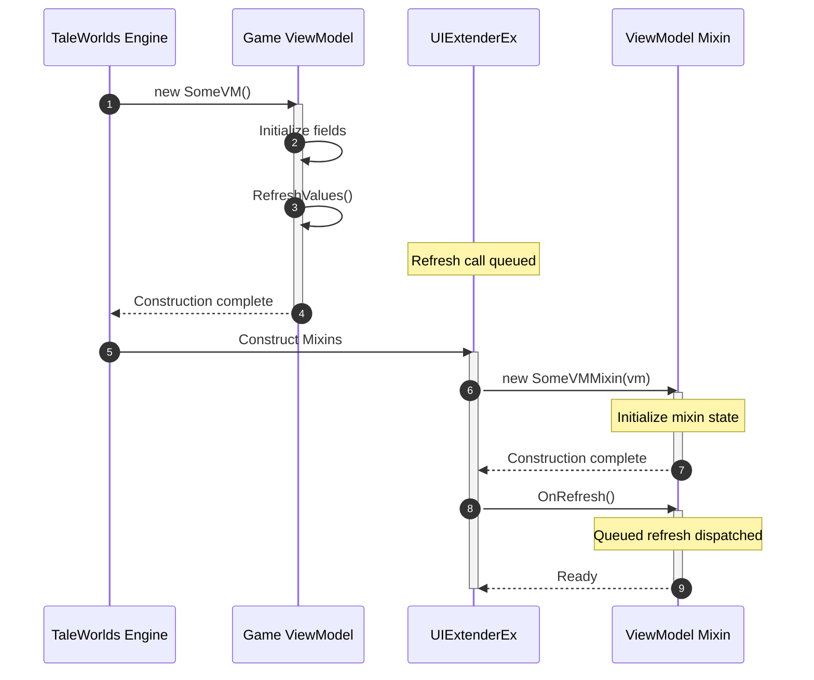

# Mixin Hooks

In previous versions of UIExtenderEx, developers frequently had to pair [ViewModel Mixins](../v2/ViewModelMixin.md) with Harmony patches whenever they needed to intercept game methods, react to property updates, or read private ViewModel fields.

**UIExtenderEx 3.0** introduces native hooks built directly into [`BaseViewModelMixin<TViewModel>`](xref:Bannerlord.UIExtenderEx.ViewModels.BaseViewModelMixin`1), eliminating the need for Harmony across common UI extension scenarios.

---

## Quick Reference: Replacing Harmony with Mixin Hooks

| Legacy Pattern (Harmony / Reflection) | Modern 3.0 Mixin Hook | Primary Advantage |
| :--- | :--- | :--- |
| Harmony prefix or postfix on a ViewModel method | [`[BUTRViewModelOverride]`](#taking-over-a-viewmodel-method) | Covers all callers (UI, hotkeys, game code); cleanly scoped to mixin lifecycle. |
| Harmony postfix on property setters or manual `PropertyChanged` event handlers | [`OnViewModelPropertyChanged`](#hearing-every-notification) | Captures all 9 typed property notification overloads automatically. |
| `AccessTools`, `Traverse`, or `GetPrivate<T>()` reflection | [`[BUTRUnsafeAccessor]`](#reaching-private-members) | Zero reflection overhead; validated at startup during `Register`. |
| Static "current instance" fields or weak references on ViewModels | [`ViewModelMixins.Get<T>()`](#reaching-a-mixin-from-outside) | Safe, strongly-typed retrieval without memory leaks or multi-window bugs. |

---

## Taking over a ViewModel method

In standard MVVM data binding, declaring a mixin method with the same name as a native ViewModel method only redirects clicks from prefab widgets; game hotkeys, controller shortcuts, and internal C# callers continue executing the vanilla method.

Decorating a mixin method with [`[BUTRViewModelOverride]`](xref:Bannerlord.UIExtenderEx.Attributes.BUTRViewModelOverrideAttribute) intercepts the native method for **all callers**:

```csharp
using Bannerlord.UIExtenderEx.Attributes;
using Bannerlord.UIExtenderEx.ViewModels;
using System;
using TaleWorlds.MountAndBlade.ViewModelCollection.GameOptions;

[ViewModelMixin]
internal sealed class OptionsVMMixin : BaseViewModelMixin<OptionsVM>
{
    public OptionsVMMixin(OptionsVM vm) : base(vm) { }

    // Intercepts OptionsVM.ExecuteDone for all callers (UI button clicks, Escape key, etc.)
    [BUTRViewModelOverride(nameof(OptionsVM.ExecuteDone))]
    private void ExecuteDone(Action original)
    {
        // Custom pre-processing logic
        SaveCustomModSettings();

        // Invoke the original vanilla method (or omit to suppress vanilla behavior)
        original();
    }
}
```

### Execution Rules and Constraints

* **Invoking `original`:** The `original` delegate represents the next override in the chain (if multiple mods intercept the same method), culminating in the vanilla game implementation. Omitting `original()` completely suppresses the vanilla method.
* **Universal Interception:** Every caller passes through your override—whether triggered by XML or compiled prefab buttons, hotkey shortcuts, or internal TaleWorlds code.
* **Instance Scoping:** Overrides only apply to ViewModel instances where the mixin is attached and enabled. Disabling the mixin via `Extender.Disable(typeof(MyMixin))` dynamically unhooks the override.
* **Supported Method Signatures:** Only methods that return `void` and have no `ref` or `out` parameters can be overridden. The mixin method must take the target method's parameters followed by a trailing `Action` (or `Action<...>` matching the parameter types).
* **Compile-Time Validation:** The [Roslyn Analyzers](../general/Analyzers.md) emit `UIX0008` if an override signature is invalid or targets a non-existent method.

---

## Hearing every notification

To trigger UI updates when game state changes, mixins often need to respond to property changes raised by the target ViewModel.

In TaleWorlds' Gauntlet framework, most ViewModels update properties using typed `OnPropertyChangedWithValue(...)` overloads (such as `int`, `bool`, `Color`, or `Vec2`). These overloads fire specialized typed events that standard `PropertyChanged` event handlers fail to receive.

Override `OnViewModelPropertyChanged` to listen to **all nine** notification variants:

```csharp
protected override void OnViewModelPropertyChanged(string propertyName)
{
    base.OnViewModelPropertyChanged(propertyName);

    if (propertyName == nameof(MapInfoVM.IsInfoBarExtended))
    {
        // Re-evaluate your mixin property when the game updates the info bar state
        OnPropertyChanged(nameof(CustomInfoWidgetVisible));
    }
}
```

### Lifecycle and Performance

* UIExtenderEx subscribes your mixin to the target ViewModel's notification events at the conclusion of the ViewModel constructor.
* It automatically detaches all listeners when the ViewModel is finalized, preventing memory leaks.
* Property changes triggered within your mixin's own constructor do not trigger this hook.

---

## Reaching private members

When you need to read private fields or invoke non-public methods on TaleWorlds classes, reflection (`AccessTools`, `Traverse`, or `GetPrivate`) introduces runtime overhead and fails silently until executed.

Modeled after .NET 8's `UnsafeAccessorAttribute`, [`[BUTRUnsafeAccessor]`](xref:Bannerlord.UIExtenderEx.Attributes.BUTRUnsafeAccessorAttribute) allows you to define compile-time static stubs that UIExtenderEx replaces with high-performance IL accessors during mod registration:

```csharp
using Bannerlord.UIExtenderEx.Attributes;
using System;
using System.Collections.Generic;
using System.Runtime.CompilerServices;
using TaleWorlds.Library;
using TaleWorlds.MountAndBlade.ViewModelCollection.GameOptions;

internal static class OptionsAccessors
{
    // Accesses private field "List<ViewModel> _categories" on OptionsVM
    [BUTRUnsafeAccessor(BUTRAccessorKind.Field, Name = "_categories")]
    [MethodImpl(MethodImplOptions.NoInlining)]
    public static ref List<ViewModel> GetCategories(OptionsVM instance) => throw new NotImplementedException();
}
```

### Accessor Kinds (`BUTRAccessorKind`)

| `BUTRAccessorKind` | Target | Stub Signature Pattern |
| :--- | :--- | :--- |
| `Field` | Instance field | Takes the instance as parameter 1; returns the field type by `ref`. |
| `Method` | Instance method | Takes the instance as parameter 1, followed by method arguments; returns the method's return type. |
| `StaticField` | Static field | Takes no parameters; returns the field type by `ref`. Specify declaring type on attribute: `[BUTRUnsafeAccessor(..., typeof(DeclaringClass))]`. |
| `StaticMethod` | Static method | Takes the method's parameters; returns the method's return type. Specify declaring type on attribute. |

### Stub Requirements

* **`static` Method:** The stub method must be declared `static`.
* **No Inlining:** Always annotate the stub with `[MethodImpl(MethodImplOptions.NoInlining)]` to prevent callers from inlining the stub body before UIExtenderEx patches it.
* **Throwing Body:** Provide a stub body such as `throw new NotImplementedException();`. This body is overwritten with IL at runtime.
* **Fail-Fast Startup Validation:** During `Extender.Register(...)`, UIExtenderEx verifies all accessors. If a game update renames a private field, UIExtenderEx logs an error immediately at startup rather than throwing null reference exceptions during gameplay.

---

## Reaching a mixin from outside

When external code (such as campaign behaviors, event listeners, or Harmony patches in other systems) holds a reference to a `ViewModel` and needs to interact with its attached mixin, use [`ViewModelMixins`](xref:Bannerlord.UIExtenderEx.ViewModels.ViewModelMixins):

```csharp
using Bannerlord.UIExtenderEx.ViewModels;

// Retrieve the attached mixin instance (returns null if not attached; disabling a mixin does not detach it)
if (ViewModelMixins.Get<MapInfoMixin>(mapInfoVM) is { } mixin)
{
    mixin.UpdateCustomData();
}

// Safely project a single property value with fallback to default
int relation = ViewModelMixins.Select<KingdomClanItemVMMixin, int>(clanItemVM, x => x.CustomRelationScore);
```

### Why Avoid Common Workarounds?

* **WeakReference properties on the ViewModel:** Pollutes the Gauntlet data binding table with unnecessary member names.
* **Static "Current" Singletons:** Causes subtle bugs whenever multiple screens or popup modals exist simultaneously.
* **Untyped Reflection:** Lacks compile-time safety and suffers from performance overhead.

---

## The refresh rule

When configuring automated refresh handling via `[ViewModelMixin(nameof(SomeVM.RefreshValues))]`:



> [!IMPORTANT]
> **Set up state in your constructor, and do not call `OnRefresh()` or the ViewModel's refresh method from within the constructor!**
> 
> A scan of Bannerlord's codebase reveals that **431 out of 535 ViewModels** invoke `RefreshValues()` directly within their own constructors. UIExtenderEx intercepts this initial refresh and automatically forwards it to your mixin's `OnRefresh()` method **immediately after your mixin finishes constructing**.
> 
> Manually calling `OnRefresh()` or `vm.RefreshValues()` in your mixin constructor causes your initialization logic to execute twice on every screen load.

---

## What registration reports

During `Extender.Register(...)`, UIExtenderEx scans registered assemblies and logs detailed diagnostics for configuration issues:

1. **Member Collisions:** Warns when a mixin declares a property or method whose name collides with a native member on the target ViewModel.
2. **Cross-Mod Collisions:** If two different mods register mixins that introduce the same property name to a single ViewModel, UIExtenderEx binds the last registered property and logs a warning naming both mods.
3. **Unmatched Abstract Mixins:** Warns if an abstract ViewModel is targeted without setting `handleDerived: true`.
4. **Resilient Assembly Loading:** If an assembly contains a mixin targeting an uninstalled DLC or missing dependency, UIExtenderEx skips the unresolvable mixin and continues registering all other valid types.
